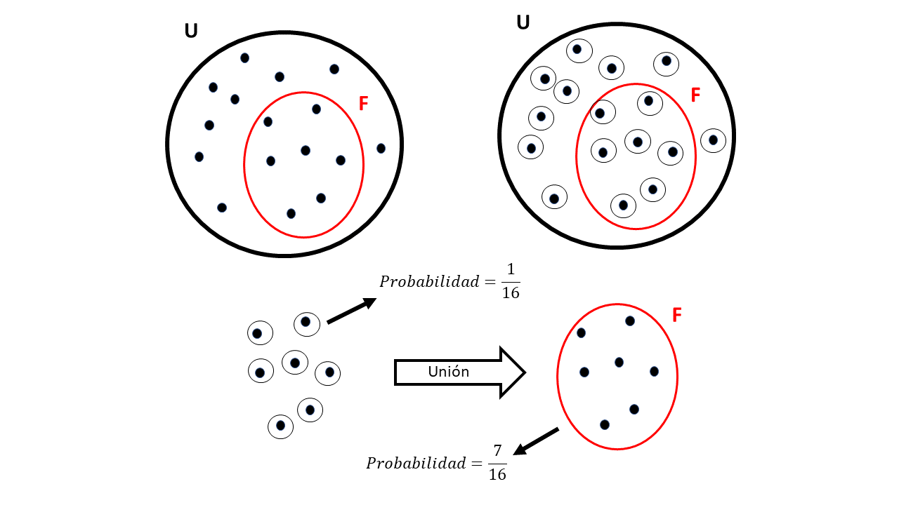
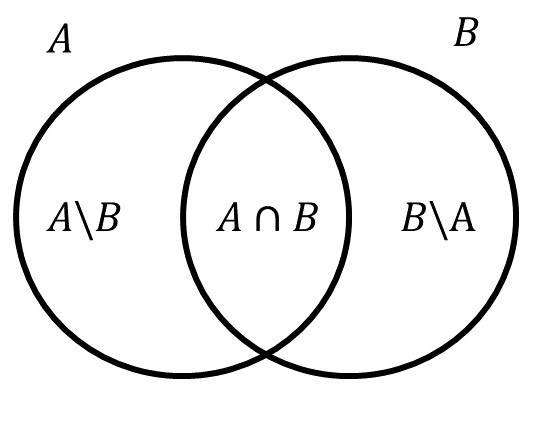

```{r echo=F, message = FALSE, warning =F}
###see https://bookdown.org/yihui/rmarkdown-cookbook/cross-ref.html for cross reference
###see https://bookdown.org/yihui/bookdown/internationalization.html for _bookdown.yml
rm(list=ls())
library(pacman)
p_load(tidyverse)
p_load(kableExtra)
p_load(knitr)
p_load(ggbeeswarm)
p_load(latex2exp)
p_load(epitab)
p_load(plotrix)
p_load(graphics)
p_load(latex2exp)
set.seed(150)
```


```{r echo=FALSE, results = 'asis'}
ca_ctr_r<-.3
n<-250
nCA<-round(n*ca_ctr_r)
z0<-data.frame(status=factor(c(rep("CA",nCA),rep("CTR",n-nCA))))
z0$exposition<-NA
exp_CA<-.45
exp_CTR<-.19
z0[z0$status %in% "CA","exposition"]<-ifelse(runif(nCA)<exp_CA,"yes","no")
z0[z0$status %in% "CTR","exposition"]<-ifelse(runif(n-nCA)<exp_CA,"yes","no")
z0$exposition<-factor(z0$exposition,levels = c("yes","no"))
```
# Introducción
En este documento estudiaremos los conceptos básicos de probabilidad. Para empezar, consideremos un ejemplo, se han recopilado unos datos de un estudio de casos y controles, `r nCA` casos y `r n-nCA` controles, para un total de `r n` individuos. Se han estudiado a estos individuos para ver si habían estado expuestos a un agente toxico de interés para los investigadores. A continuación presentamos un breve resumen de los datos.

```{r , echo=F, fig.width=6, fig.height=4}
summary(z0)
```

Para visualizar mejor la información, construiremos una tabla de contingencia para las dos variables, ver tabla \@ref(tab:conttabl)
```{r conttabl, echo=FALSE}
###see http://haozhu233.github.io/kableExtra/awesome_table_in_html.html
res<-kbl(t(table(z0)%>%addmargins),caption="Tabla de contingencia status vs exposition")
kable_styling(res,"striped", position = "center",full_width = F)%>% add_header_above(c("exposition","status"=2," "))
# res<-t(table(z0)%>%addmargins)
# knitr::kbl(res,caption="Tabla de contingencia: status vs exposition")
```

Al rededor de esta tabla de contingencia podemos hacernos varias preguntas como, por ejemplo:

* Cual es la probabilidad de ser un caso? 

* Cual es la probabilidad de estar expuesto?

* Cual es la probabilidad de ser un caso o no estar expuesto?

* Cual es la probabilidad de ser un control y no estar expuesto simultáneamente?

* Dado que se es un caso, cual es la probabilidad de estar expuesto?

Para responder estas preguntas de manera metódica se han desarrollado los axiomas de probabilidad. Estos axiomas son las reglas que nos permitirán calcular probabilidades bajo ciertas condiciones y de manera segura, evitando recurrir a la intuición. La probabilidad es una medida que se aplica a conjuntos (denominados eventos en la práctica). Por tanto, el lenguaje en el que se encuentran codificados estos axiomas se base en el lenguaje de teoría de conjuntos, el cual repasaremos a continuación.

# Teoría de conjuntos

Un conjunto se define por sus elementos, por ejemplo, los estudiantes del curso A (Ana, Juan, Pedro, Laura, Silvia) y los estudiantes del curso B (Carlos, Diana):
<center>
```{r TCexample,echo=F,warning =F, fig.width=6, fig.height=6, fig.cap="Ejemplos sobre conjuntos"}
plot(NULL,xlim=c(-10,15),ylim=c(-11,12.5),axes=F,xlab="",ylab="")
rect(-10,-11,15,12)
draw.circle(0,0,9,nv=1000,lty=1,lwd=1,border="blue")
draw.circle(10,9,2.5,nv=1000,lty=1,lwd=1,border="red")
draw.circle(4.25,1.75,2.7,nv=1000,lty=1,lwd=1,border=3)
df_curso<-data.frame(name=c("Ana","laura","Pedro","Juan","Silvia","Carlos","Diana"),x=c(-5,0,4.5,4.2,-3,10,10),y=c(2,-5,3.5,0,7,10,7.9))
text(df_curso$x,df_curso$y,df_curso$name)
text(-7.8,7,"A",col="blue",cex=1.5)
text(13.8,10,"B",col="red",cex=1.5)
text(2.5,5,"C",col=3,cex=1.5)
text(-10,12.7,"U",col=1,cex=1.5)
```
</center>

En el lenguaje de teoría de conjuntos existen dos relaciones fundamentales:

* La pertenencia $\in$
* La contenencia $\subset$

Los elementos pertenecen a conjuntos (por ejemplo $Silvia \in A$), los conjuntos están contenidos en otros conjuntos ($C \subset A$). Es incorrecto decir que Carlos está contenido en el conjunto B, ya que Carlos es un elemento y no un conjunto. También es incorrecto decir que $C\in A$ ya que C es un subconjunto de A y no un elemento (ver figura \@ref(fig:TCexample)). En resumen, afirmaciones correctas sobre la figura \@ref(fig:TCexample) son:

* $Ana \in A$

* $Carlos \in B$

* $C \subset A$

Afirmaciones incorrectas sobre la figura \@ref(fig:TCexample) son:

* $Ana \subset A$

* $C \in A$

La forma de expresar que un elemento no pertenece a un conjunto, como, por ejemplo, "Ana no pertenece a C", es mediante el símbolo $\notin$, de tal forma que $Ana \notin C$. De manera similar, para expresar que un conjunto no está incluido en otro ("B no está incluido en A") se usa el símbolo $B \not\subset A$, ver figura \@ref(fig:TCexample).

En la figura \@ref(fig:TCexample) los conjuntos se presentan de manera **grafica**, sin embargo existen otras formas de notación de los conjuntos. A continuación presentamos la notación **extensiva**:

* $A=\{Ana,laura,Pedro,Juan,Silvia\}$

* $B=\{Carlos,Diana\}$

* $C=\{Pedro,Juan\}$

En esta notación se usan los corchetes $\{\}$ como análogo del laso en la representación gráfica, y dentro de estos, se listan de manera **extensiva** los elementos del conjunto separados por ",".

Existe otra forma de definir conjuntos, denominada la definición por **comprensión**, veamos un ejemplo: "C es el conjunto de personas en el conjunto A *tal que* esas personas son hombres." Aquí, se usa una condición, que define la pertenencia de elementos a un conjunto. Esta es la forma más común de definir conjuntos y es la que adoptaremos regularmente en este texto.

La definición por extensión siempre comprende 2 partes. Veamos nuestro ejemplo: C es el conjunto

1. de personas en el conjunto A

2. *tal que* esas personas son hombres.

La primera parte hace referencia al conjunto de referencia, sobre el cual se aplicará una condición lógica, la segunda parte de la definición. 

Bajo esta forma de definir conjuntos, existe un concepto fundamental, el del conjunto universo:

* El universo es el conjunto que contiene a todos los posibles elementos. 

En la figura \@ref(fig:TCexample) el universo se representa por el conjunto $U$.

La forma en que se define un conjunto por compresión sigue el siguiente patrón:

$$T=\{x \in U | Cond(x)\}$$
Su interpretación es la siguiente: T es el conjunto ($T=\{ \}$) de los elementos del universo ($x \in U$), tal que ($|$), esos elementos cumplen una condición determinada ($Cond(x)$).

Por ejemplo, considérese el conjunto de los números entero como el universo: $\mathbb{Z}=\{...,-2,-1,0,1,2,...\}$, entonces, el conjunto de los números positivos se definirá como

$$Positivos=\{x \in \mathbb{Z} | x > 0 \}$$


## Operaciones de conjuntos

a continuación presentaremos las tres operaciones básicas de conjuntos: La _**Unión**_ ,la  _**Intersección**_ y el _**Complemento**_.

### Unión
La unión de dos conjuntos da como resultado un nuevo conjunto que contiene todos los elementos de los dos conjuntos unidos. Consideremos dos conjuntos $A$ y $B$ cualquiera incluidos en un conjunto universo $U$. Entonces, la Unión entre $A$ y $B$ se define como:

$$A \cup B =\{x \in U | x \in A \; ó \; x \in B\}$$
La interpretación de la anterior formula es así: La Unión entre $A$ y $B$ ($A \cup B$), es el conjunto ($=\{\}$) de los elementos en el universo ($x \in U$), tal que ($|$), esos elementos pertenecen al conjunto $A$ **ó** pertenecen al conjunto $B$ ($x \in A \; ó \; x \in B$).
 
 Veamos un ejemplo, en el universo de la figura \@ref(fig:TCexample), $B \cup C=\{Carlos, Diana,Pedro, Juan\}$.
 
 Veamos otro ejemplo en la figura \@ref(fig:TCexample2)
<center>
```{r TCexample2,echo=F,warning =F, fig.width=6, fig.height=6, fig.cap="Ejemplo 2 sobre conjuntos"}
plot(NULL,xlim=c(-10,10),ylim=c(-7,8),axes=F,xlab="",ylab="")
rect(-10,-7,10,7)
draw.circle(-3,0,5,nv=1000,lty=1,lwd=1,border="blue")
draw.circle(3,0,5,nv=1000,lty=1,lwd=1,border="red")
df_ex2<-data.frame(name=c("a","b","c","d","e","f","g"),x=c(-5,-3,0,0,3.5,5,7.5),y=c(2,-2,-2,2.5,-3,2.8,-5))
text(df_ex2$x,df_ex2$y,df_ex2$name)
text(-10,7.5,"U")
text(-7,4,"Z",col=4)
text(7,4,"W",col = 2)
```
</center>

En la figura se puede apreciar que $Z\cup W =\{a,b,c,d,e,f\}$

### Intersección
La Intersección de dos conjuntos da como resultado un nuevo conjunto que contiene todos los elementos que se encuentran simultáneamente en ambos conjuntos. Consideremos dos conjuntos $A$ y $B$ cualquiera incluidos en un conjunto universo $U$. Entonces, la Intersección entre $A$ y $B$ se define como:

$$A \cap B =\{x \in U | x \in A \; y \; x \in B\}$$
La interpretación de la anterior formula es así: La Intersección entre $A$ y $B$ ($A \cap B$), es el conjunto ($=\{\}$) de los elementos en el universo ($x \in U$), tal que ($|$), esos elementos pertenecen al conjunto $A$ **y** pertenecen al conjunto $B$ simultáneamente ($x \in A \; ó \; x \in B$).

Veamos un ejemplo, en el universo de la figura \@ref(fig:TCexample2) se puede apreciar que $Z\cap W =\{c,d\}$, ya que los elementos c y d son los únicos que se encuentran simultáneamente en ambos conjuntos.

### Complemento

En las dos operaciones anteriores, vimos que las condiciones lógicas que definen los conjuntos son "ó" e "y". Para la definición del complemento la palabra clave será el "no". Consideremos un conjunto $A$ cualquiera incluido en un conjunto universo $U$. Entonces el complemento del conjunto A se define como 
$$A^c=\{x \in U | x \notin A\}$$

La interpretación de la anterior formula es así: El complemento del conjunto A ($A^c$) es el conjunto ($=\{\}$) de los elementos del universo ($x \in U$), tal que ($|$), esos elementos **no** pertenecen a el conjunto A ($x \notin A$).
$A^c$ Es simplemente el conjunto de todos aquellos elementos que **no** pertenecen a el conjunto A.

Por ejemplo, en la figura \@ref(fig:TCexample2), $Z^c=\{f,e,g\}$. De manera similar $W^c=\{a,b,g\}$.

Ejercicio:
cuál es el complemento del complemento del conjunto $Z$  en la figura \@ref(fig:TCexample2)?
Deduzca de esto que en general para cualquier conjunto $A$, $(A^c)^c=?$

### Conmutatividad

Se puede demostrar que lo siguiente se cumple:
$$A\cup B= B\cup A$$
$$A\cap B= B \cap A$$
Es decir que no importa el orden de los conjuntos en la unión y la intersección.

## El conjunto Vacío $\phi$

Si el conjunto $U$ es el conjunto universo, para el cual, cualquier elemento pertenece a él, quien sera entonces el complemento del universo, es decir $U^c$?. Según la definición de complemento, tendríamos que:

$$U^c=\{x \in U | x \notin U\}$$
Es decir, que $U^c$ es el conjunto de aquellos elementos que simultáneamente están y a la vez no están en el universo. Esto en lógica se conoce como una contradicción, por lo cual no existe ningún elemento que pertenezca a $U^c$, por tanto, el conjunto $U^c$ es vacío.

Este vacío suele representarse de forma extensiva como $U^c=\{\}$. De aquí en adelante denotaremos al conjunto vacío mediante la letra griega $\phi$ (phi).

El conjunto vacío tiene algunas propiedades, que presentamos a continuación. Considere un conjunto $A$ cualquiera, incluido en un Universo $U$. Entonces:

* $\phi \subset A$

* $\phi \cup A=A$

* $\phi \cap A= \phi$

## Propiedades generales de las operaciones de conjuntos

A continuación listamos algunas propiedades generales que se surgen a partir de las definiciones de la _**Unión**_ ,la  _**Intersección**_ y el _**Complemento**_. Para esto considere dos conjuntos $A$ y $B$ cualquiera, incluidos en el universo $U$.

* $A \cup U =U$

* $A \cap U =A$

* Si $A \subset B$ entonces $A \cup B =B$ y $A \cap B =A$

* $A \cup A^c =U$

* $A \cap A^C= \phi$

## Aplicaciones prácticas de las operaciones de conjuntos

La discusión de las operaciones de conjuntos hecha hasta el momento es abstracta y bastante general, y la mayoría de los estudiantes duda de la importancia de estos conceptos en la práctica. Por esta razón, mostraremos a continuación la utilidad de estos conceptos en problemas de investigación. Para esto retomaremos el ejemplo con el que se inició este documento y lo reproducimos nuevamente para facilidad de lectura.

Se han recopilado unos datos de un estudio de casos y controles, `r nCA` casos y `r n-nCA` controles, para un total de `r n` individuos. Se han estudiado a estos individuos para ver si habían estado expuestos a un agente toxico de interés para los investigadores. La información recopilada se resume en la siguiente tabla de contingencia:

```{r conttablrep, echo=FALSE}
res<-kbl(t(table(z0)%>%addmargins),caption="Tabla de contingencia status vs exposition")
kable_styling(res,"striped", position = "center",full_width = F)%>% add_header_above(c("exposition","status"=2," "))
# res<-t(table(z0)%>%addmargins)
# knitr::kbl(res,caption="Tabla de contingencia: status vs exposition")
```

En este caso, la variable “status” con categorías "CA" y "CTR", realmente indexan la pertenencia de individuos a dos conjuntos: el de los casos (CA) y el de los controles (CTR). De tal forma que en la tabla \@ref(tab:conttablrep) podemos saber cuántas personas hay en el conjunto CA y en el conjunto CTR. Según la tabla podemos ver que hay 75 personas en el conjunto "CA" y 175 en el conjunto "CTR". 

De manera similar, la variable "exposition" con categorías "yes" y "no" indexan la pertenencia de cada sujeto del estudio a los conjuntos de exposición y no exposición respectivamente. Teniendo esto en cuenta, podríamos pensar por ejemplo en:

$$CA \cup yes$$

Es decir, la unión entre el conjunto de casos y el conjunto de personas expuestas. ¿Cuantas personas hay en este conjunto? La respuesta puede ser deducida a partir de la siguiente visualización:

<div class = "row">
<div class = "col-md-6">
```{r conttablrep1, echo=FALSE}
res<-kbl(t(table(z0)),caption="CA unido \"yes\"")
kable_styling(res,"striped", position = "center",full_width = F)%>% add_header_above(c("exposition","status"=2))%>%
  column_spec(2,background = "green")%>%
  row_spec(1,background = "green")
# res<-t(table(z0)%>%addmargins)
# knitr::kbl(res,caption="Tabla de contingencia: status vs exposition")
```
</div>
<div class = "col-md-6">
```{r CAUyesfig,echo=F,warning =F, fig.width=4, fig.height=4, fig.cap="Visualizacion de CA y yes en conjuntos"}
plot(NULL,xlim=c(-10,10),ylim=c(-7,8),axes=F,xlab="",ylab="")
rect(-10,-7,10,7)
draw.circle(-3,0,5,nv=1000,lty=1,lwd=1,border="blue")
draw.circle(3,0,5,nv=1000,lty=1,lwd=1,border="red")
df_ex3<-data.frame(name=c(46,29,75),x=c(-3.9,0,3.9),y=c(0,0,0))
text(df_ex3$x,df_ex3$y,df_ex3$name)
text(-7,4,"CA",col=4)
text(7,4,"yes",col = 2)
```
</div>
</div>

El número de personas en $CA \cup yes$ es $46+29+75=`r 46+29+75`$ .

Que interpretación tiene $CA \cup yes$ desde el punto de vista práctico? son las personas enfermas (CA) o que han estado expuestas (yes) al agente toxico de estudio. Veamos otro ejemplo:

$$CTR \cap no$$
Este conjunto es el de aquellas personas que no están enfermas (CTR) y que adicionalmente no han tenido exposición al agente toxico de estudio (no). Cuantas personas hay en este conjunto? de la tabla \@ref(tab:conttablrep) se puede apreciar que son 100 personas.

# Axiomas de probabilidad

Ahora que ya repasamos el lenguaje de teoría de conjuntos, podemos empezar nuestro abordaje de los axiomas de probabilidad que nos permitirán hacer cálculos probabilísticos.

## El universo

Nuestra discusión de los axiomas de probabilidad empieza con la definición del universo. Para nosotros el universo es el conjunto de todos los posibles resultados en nuestro objeto de estudio. Por ejemplo, si se estudia el lanzamiento de una moneda, los posibles resultados son *cara* o *sello*, luego el universo es el conjunto $U=\{cara,sello\}$. Si estudiamos el lanzamiento de un dado, el conjunto de posibles resultados es $U=\{1,2,3,4,5,6\}$. Estos ejemplos son triviales y poco prácticos, para nuestro ejemplo del estudio de casos y controles cual sería el conjunto universo? seria el conjunto de las 250 personas involucradas en el estudio (ver tabla \@ref(tab:conttablrep)).

## La medida de probabilidad

Nuestro objeto de estudio en este documento es la probabilidad, y es hora de definirla de manera concreta: La probabilidad es una medida que se aplica a conjuntos. ¿Que se quiere decir con esto? básicamente que el objeto de medida de la probabilidad son los conjuntos. Análogamente, el objeto de medida de una báscula es un objeto físico, el objeto de medida del pH son soluciones, el objeto de medida de una prueba diagnóstica son pacientes, etc. Ya sabemos a qué objetos podemos aplicar la medida de probabilidad, sin embargo, aún no hemos respondido la pregunta: ¿Que significa la medida de probabilidad?, ¿Que significa una probabilidad del 50% o del 70%?, para responder a esta pregunta véase ref.

## Axiomas
Los Axiomas de probabilidad determinan las propiedades y el comportamiento de la probabilidad. 

### Axioma 1
\begin{equation}
Si \; A \subseteq U \Rightarrow 0\le P(A) \le 1 (\#eq:A1)
\end{equation}


La formula \@ref(eq:A1) establece que la medida de probabilidad se aplica a subconjuntos en algún conjunto universo $U$ y que su resultado es un número real entre 0 y 1. La interpretación de la formula \@ref(eq:A1) es la siguiente:

Si $A$ es un subconjunto del universo $U$, el cual podría llegar a ser el mismo universo ($A \subseteq U$), entonces ($\Rightarrow$), la medida de probabilidad de $A$ ($P(A)$), es un número real entre 0 y 1 ($0\le P(A) \le 1$).
Este axioma se considera como la definición de medida de probabilidad.

Nota: en esta discusión, las probabilidades son números entre 0 y 1. Para algunos es más cómodo hablar de probabilidades entre 0 y 100%. Se sugiere hacer los cálculos con probabilidades entre 0 y 1 ya que son más simples. Para pasar de la escala $0-100$ a la escala $0-1$, basta con dividir por 100 a las probabilidades en escala $0-100$.

### Axioma 2
\begin{equation}
P(U)=1 (\#eq:A2)
\end{equation}

Este axioma establece que la medida de probabilidad del conjunto universo es 1. Veamos por qué esto tiene sentido: supongamos que $U=\{cara,sello\}$, y que nuestro objeto de estudio es lanzar una moneda y observar que lado cae hacia arriba. Decir que $P(U)=1$, implica que al lanzar la moneda observaremos algún posible resultado en $U$, cara o sello, observar algo diferente sería imposible y por tanto la probabilidad de observar alguno de los dos resultados (cara o sello) es 1.

### Axioma 3
\begin{equation}
Si \; A \subseteq U \Rightarrow P(A^c) = 1- P(A) (\#eq:A3)
\end{equation}

La interpretación de esta fórmula es la siguiente: Si $A$ es un subconjunto del universo $U$, el cual podría llegar a ser el mismo universo ($A \subseteq U$), entonces ($\Rightarrow$), la medida de probabilidad del complemento de A ($P(A^c)$) es 1 menos la probabilidad del mismo conjunto ($1- P(A)$). Este axioma establece que la medida de probabilidad de un conjunto complemento es 1 menos la probabilidad del mismo conjunto. Veamos un ejemplo:

Suponga que, en una población, el porcentaje de mujeres es del 40%, es decir que $P(Femenino)=0.4$. ¿En este contexto que sería $Femenino^c$? Seria simplemente el conjunto de las persona que no son mujeres, es decir los hombres, luego $Femenino^c= Masculino$ y según la formula \@ref(eq:A3), $P(Femenino^c)=P(Masculino)=1-P(Femenino)=1-0.4=0.6$, lo cual tiene sentido.

Esta noción de complemento es sumamente útil al resolver ejercicios de probabilidad. Veamos otro ejemplo: En una población dada, la probabilidad de desarrollar cáncer es del 5%. Esto quiere decir que existe un conjunto que llamaremos $Ca$, el cual es el conjunto de personas con cáncer y por tanto $P(Ca)=0.05$ (5%/100=0.05). Esto implica, según la formula \@ref(eq:A3), que $P(Ca^c)=1-0.05=0.95$, $Ca^c$ es el complemento del conjunto de personas con cáncer, es decir el conjunto de personas sanas, luego en esta población, la probabilidad de no tener cáncer es del 95%

Siempre que nos den la probabilidad de un conjunto (o evento, como también se suele llamar), automáticamente aplicando la formula \@ref(eq:A3), podemos obtener la probabilidad de su complemento. Si conocemos la probabilidad de las mujeres, conocemos también la de los hombres. Si conocemos la probabilidad de estar enfermo, automáticamente conocemos la probabilidad de estar sano.

### Axioma 4

\begin{equation}
Si \; A,B \subseteq U \; | \; A \cap B = \phi \Rightarrow P(A \cup B) = P(A)+P(B) (\#eq:A4)
\end{equation}

La interpretación de esta fórmula es la siguiente:  Si $A$ y $B$ son subconjuntos del universo $U$ ( $A,B \subseteq U$), tal que ($|$) la intersección de $A$ y $B$ es vacía ($A \cap B = \phi$), entonces ($\Rightarrow$), la probabilidad de la unión de $A$ y $B$ se puede calcular como la suma de las probabilidades de $A$ y $B$ ($P(A \cup B) = P(A)+P(B)$)

Este axioma es uno de los más importantes de todos. A continuación, explicaremos su utilidad. Supongamos que una población (es decir conjunto universo $U$) de 16 personas, 7 son mujeres. ¿Si seleccionáramos una persona al azar, cual sería la probabilidad de que la persona fuera mujer? Supongamos que la probabilidad de ser seleccionado es la misma para cualquiera de las 16 personas y por ende esta probabilidad es $1/16$. Consideremos conjuntos de un único elemento, cada una de las 16 personas. Es claro que estos conjuntos son disyuntos entre si (es decir la intersección es vacía). Si cogemos todos los conjuntos de personas mujeres y los unimos, obtendríamos el conjunto de las mujeres. Aplicando la formula \@ref(eq:A4) la probabilidad de este conjunto seria la suma de las probabilidades individuales de cada conjunto, lo cual corresponde a $7 \times 1/16=0.4375$ (ver figura \@ref(fig:A4image))).

```{r A4image,echo=F,warning =F, fig.width=4, fig.height=4, fig.cap="Ejemplo axioma 4"}

```

Este axioma justifica el cálculo de probabilidades aplicando la regla de contar el número de casos que cumplen la condición dividiendo por el número total de casos en la población (Esto sin embargo, solo es válido si se asume que cada individuo tiene la misma probabilidad de ocurrencia).

En el ejemplo de los casos y controles de la tabla \@ref(tab:conttablrep), la probabilidad de ser expuesto al agente toxico en esa población sería de $\frac{104}{250}=0.416$

```{r echo=FALSE, results = 'asis'}
N<-1000
v1_nc<-3
v2_nc<-2
v1_props<-c(.24,.35,1-(.24+.35))
names(v1_props)<-LETTERS[1:length(v1_props)]
v2_given_v1probs<-matrix(c(.1,.9,
                           .3,.7,
                           .18,1-.18),byrow =T,ncol = 2)
colnames(v2_given_v1probs)<-c("R","S")
rownames(v2_given_v1probs)<-names(v1_props)
(N*v1_props)%>%round(1)->v1_n
z1<-data.frame(v1=rep(names(v1_props),v1_n),v2=NA)
for(i in names(v1_props)){
  z1[z1$v1 %in% i,"v2"]<-sample(colnames(v2_given_v1probs),v1_n[i],T,v2_given_v1probs[i,])
}
z1$v2<-factor(z1$v2)
```
Veamos otro ejemplo. Una empresa con tres fábricas produce prótesis ortopédicas. Se ha realizado un estudio en donde se han extraído `r N` prótesis de un lote de producción de las tres fábricas y se ha determinado si las prótesis superan (S) o reprueban (R) una prueba de control de calidad. En la tabla \@ref(tab:conttablz1) se presentan los resultados de dicho estudio.
```{r conttablz1, echo=FALSE}
###see http://haozhu233.github.io/kableExtra/awesome_table_in_html.html
res<-kbl(t(table(z1)%>%addmargins),caption="Tabla de contingencia Fabrica vs Falla")
kable_styling(res,"striped", position = "center",full_width = F)%>% add_header_above(c("Falla","Fabrica"=3," "))
# res<-t(table(z0)%>%addmargins)
# knitr::kbl(res,caption="Tabla de contingencia: status vs exposition")
```

¿Cuál es la probabilidad de que una prótesis provenga de la fábrica A? Según la tabla \@ref(tab:conttablz1), el número de prótesis producidas en la fábrica A es de `r table(z1$v1)["A"]` y el número total de prótesis es de `r N`, luego la probabilidad de que una prótesis provenga de la fábrica A es de `r table(z1$v1)["A"]/N`.

Cuál será la probabilidad de que una prótesis provenga de la fábrica B y haya superado la prueba de control de calidad? En términos de conjuntos, se nos está preguntando por $P(B \cap S)$. Nótese que hasta el momento no hay ninguna regla de probabilidad que hable de intersecciones. Sin embargo, como conocemos el número de elementos en el conjunto $B \cap S$ (`r  t(table(z1))["S","B"] `), podemos calcular esta probabilidad como $P(B \cap S)=\frac{`r  t(table(z1))["S","B"] `}{`r  N`}=$ `r  t(table(z1))["S","B"]/N ` usando la regla \@ref(eq:A4).

¿Cuál es la probabilidad de que una prótesis provenga de la fábrica A o C? Esta pregunta se puede traducir en términos de lenguaje de teoría de conjuntos como $P(A \cup C)$. Nótese que $A \cap C =\phi$, es decir, no hay prótesis que hayan sido fabricadas simultáneamente en las dos fábricas, por tanto, aplicando la formula \@ref(eq:A4), $P(A \cup C)= P(A)+P(C)=\frac{`r table(z1$v1)["A"]`}{`r N`}+\frac{`r table(z1$v1)["C"]`}{`r N`}=`r table(z1$v1)["A"]+table(z1$v1)["C"]`/`r N`= `r (table(z1$v1)["A"]+table(z1$v1)["C"])/N`$.

### Axioma 5

\begin{equation}
Si \; A,B \subseteq U \Rightarrow P(A \cup B) = P(A)+P(B)-P(A \cap B) (\#eq:A5)
\end{equation}

La interpretación de esta fórmula es la siguiente:  Si $A$ y $B$ son subconjuntos del universo $U$ ( $A,B \subseteq U$), entonces ($\Rightarrow$), la probabilidad de la unión de $A$ y $B$ se puede calcular como la suma de las probabilidades de $A$ y $B$ menos la probabilidad de la intersección ($P(A \cup B) = P(A)+P(B)-P(A \cap B)$)

Esta regla se puede deducir de la formula \@ref(eq:A4). Nótese que $A\cup B = (A \setminus B) \cup (A\cap B) \cup (B\setminus A)$ en donde $A \setminus B$ es el conjunto de los elementos que están en $A$ pero no en $B$. En notación de teoría de conjuntos seria $A\setminus B=\{x \in U | x \in A \; y  \, x \notin B\}$, también puede demostrarse que $A\setminus B= A \cap B^c$. ver figura \@ref(fig:A5image). 

<center>
```{r A5image,echo=F,warning =F, fig.width=4, fig.height=4, fig.cap="Derivación regla 5"}

```
</center>

Nótese que $(A\setminus B) \cup (A\cap B) \cup (B\setminus A)$ es una unión disyunta (es decir que los tres conjuntos tienen intersecciones mutuas vacías). Por tanto la regla \@ref(eq:A4) se puede aplicar y $P(A\cup B)= P(A \setminus B) + P(A\cap B) + P(B \setminus A)$. Por otra parte nótese que $P(A)= P(A \setminus B) + P(A\cap B)$ luego $P(A \setminus B)= P(A) - P(A\cap B)$. De manera similar $P(B)= P(A\cap B) + P(B \setminus A)$ y por tanto $P(B \setminus A)=P(B)-P(A\cap B)$. De tal forma que

$$P(A\cup B)= P(A \setminus B) + P(A\cap B) + P(B \setminus A)$$
$$=P(A) - P(A\cap B)+P(A\cap B)+P(B)-P(A\cap B)$$
$$=P(A)+P(B)-P(A \cap B)$$

En conclusión, viendo la figura \@ref(fig:A5image), se puede ver que si se suma $P(A)+P(B)$ se está sumando dos veces el pedazo $P(A\cap B)$ por tanto lo restamos una vez $P(A\cap B)$, obteniendo la formula \@ref(eq:A5).

Veamos cómo se aplica esta regla en un caso práctico. Retomemos el ejemplo de las fábricas de prótesis ortopédicas.

```{r conttablz1rep, echo=FALSE}
###see http://haozhu233.github.io/kableExtra/awesome_table_in_html.html
res<-kbl(t(table(z1)%>%addmargins),caption="Tabla de contingencia Fabrica vs Falla")
kable_styling(res,"striped", position = "center",full_width = F)%>% add_header_above(c("Falla","Fabrica"=3," "))
# res<-t(table(z0)%>%addmargins)
# knitr::kbl(res,caption="Tabla de contingencia: status vs exposition")
```

cuál es la probabilidad de que una prótesis haya sido fabricada en la fábrica A o que la prótesis halla reprobado la prueba? En términos de notación de teoría de conjuntos, se nos está preguntando por $P(A \cup R)$. Según la regla \@ref(eq:A5) tenemos que 
$$P(A \cup R)=P(A)+P(R)-P(A \cap R)$$
$$=\frac{`r table(z1$v1)["A"]`}{`r N`}+\frac{`r table(z1$v2)["R"]`}{`r N`}-\frac{`r table(z1)["A","R"]`}{`r N`}=\frac{`r table(z1$v1)["A"]+table(z1$v2)["R"]-table(z1)["A","R"]`}{`r N`}=`r (table(z1$v1)["A"]+table(z1$v2)["R"]-table(z1)["A","R"])/N`$$
ver tabla \@ref(tab:conttablz1rep)

### Axioma 6: Probabilidad condicional

\begin{equation}
Si \; A,B \subseteq U \Rightarrow P(A|B) =\frac{P(A \cap B)}{P(B)} (\#eq:A6)
\end{equation}

Esta regla define el concepto de probabilidad condicional $P(A|B)$ (diferente de $A \setminus B$ diferencia de conjuntos). $P(A|B)$ se lee como "La probabilidad de $A$ dado el conjunto $B$". Este concepto es útil ya que permite restringir el análisis de una probabilidad, que normalmente ocurriría en el contexto del conjunto universo, a un conjunto más reducido. Veamos un ejemplo. 

La probabilidad de desarrollar artritis reumatoide ($AR$) en la población general es del 3% ( $P(AR)=0.03$ ) pero en mujeres ($F$), es más alta, del 6%. Esto querría decir que $P(AR | F)=0.06$, ya que la probabilidad $P(AR)$ se quiere evaluar no en la población general, si no en el grupo exclusivo de mujeres. A la probabilidad $P(AR)=0.03$, se suele denominar una **probabilidad marginal**, haciendo énfasis en que el evento en consideración no es condicionado por ningún otro.

Veamos un ejemplo del cálculo de una probabilidad condicional. Teniendo en cuenta la información de la tabla \@ref(tab:conttablz1rep), cual es la probabilidad de que una prótesis reprobara la prueba dado que fue construida en la fábrica $A$?

La probabilidad en mención es $P(R|A)$ y según la formula \@ref(eq:A6) su calculo es $P(R|A)=\frac{P(R \cap A)}{P(A)}$. Según la tabla, $P(R \cap A)=\frac{23}{1000}$ y $P(A)=\frac{240}{1000}$ luego 

$$P(R|A)=\frac{P(R \cap A)}{P(A)}=\frac{\frac{23}{1000}}{\frac{240}{1000}}=\frac{23}{240}=0.0958$$
Es decir que la probabilidad de que una prótesis construida en la fábrica $A$ falle la prueba es del 9.58%

### Axioma 7: independencia de eventos

\begin{equation}
Si \; A,B \subseteq U, \; son \; independientes \;  \iff P(A \cap B) =P(A)P(B) (\#eq:A7)
\end{equation}

Esta regla establece cuando dos eventos (conjuntos) son independientes. La interpretación de la formula \@ref(eq:A7) es la siguiente: Dos conjuntos en el universo ($A,B \subseteq U$) son independientes, si y solo si ($\iff$), la probabilidad de la intersección es igual al producto de las probabilidades $P(A \cap B) =P(A)P(B)$

Pero que significa la independencia en la regla \@ref(eq:A7)? veamos qué pasa con la regla \@ref(eq:A6) si los eventos son independientes. Asumamos que $A$ y $B$ son dos eventos independientes y evaluemos $P(A|B)$. Según la regla \@ref(eq:A6)

$$P(A|B) =\frac{P(A \cap B)}{P(B)}$$
ya que $A$ y $B$ son independientes entonces $P(A \cap B) =P(A)P(B)$ y reemplazando en la formula anterior obtenemos 

$$P(A|B) =\frac{P(A \cap B)}{P(B)}=$$
$$\frac{P(A)P(B)}{P(B)}=$$
$$P(A)$$
Es decir que si $A$ y $B$ son independientes entonces $P(A|B)=P(A)$. Al ser eventos independientes, la probabilidad condicional es la misma probabilidad marginal. Veamos un ejemplo.

Consideremos dos eventos: el conjunto de pacientes con síndrome del túnel carpiano $TC$ y el conjunto de mujeres $F$. Si los dos eventos son independientes (es decir que la aparición del síndrome no está relacionada con el género femenino), entonces se espera que la probabilidad de desarrollar el síndrome en las mujeres sea la misma que en la población general, es decir $P(TC|F)=P(TC)$.

Otro uso de esta regla es para realizar cálculos de experimentos como el siguiente: Se sabe que, al lanzar una moneda, la probabilidad de que caiga cara ($C$) es de 0.5 y por consiguiente la probabilidad de que caiga sello ($S$) es 0.5 (¿qué regla justifica este resultado?). ¿Si se lanza la moneda 2 veces cual es la probabilidad de que se obtenga cara en el primer lanzamiento y cara en el segundo lanzamiento? asumiendo que el evento de salir cara en el segundo resultado es **independiente** del evento salir cara en el primer resultado, la probabilidad de cara, cara es $P(CC)=P(C)P(C)=0.5\times 0.5=0.25$.

El ultimo uso que discutiremos de esta regla es el siguiente: en un estudio se evalúa el hábito de fumar, caracterizado por fumar ($F$) o no fumar ($NF$) y su relación con el género (femenino $Fem$ y masculino $Mas$) a una población de $1000$ personas. Los resultados del estudio se presentan en la tabla \@ref(tab:conttablindep). Se desea determinar si el hábito de fumar es independiente del género femenino.

```{r echo=FALSE, results = 'asis'}
N<-1000
v1_nc<-2
v2_nc<-2
v1_props<-c(0.2,0.8)
names(v1_props)<-c("F","NF")
v2_props<-c(0.4,0.6)
names(v1_props)<-c("Mas","Fem")
prop_tbl<-outer(v1_props,v2_props)
count_tbl<-prop_tbl*N
colnames(count_tbl)<-c("F","NF")
```
```{r conttablindep, echo=FALSE}
###see http://haozhu233.github.io/kableExtra/awesome_table_in_html.html
res<-kbl(t(count_tbl),caption="Tabla de contingencia Genero vs hábito de fumar")
kable_styling(res,"striped", position = "center",full_width = F)
# res<-t(table(z0)%>%addmargins)
# knitr::kbl(res,caption="Tabla de contingencia: status vs exposition")
```

Podemos responder a esta pregunta usando la regla  \@ref(eq:A7). Si efectivamente el género femenino es independiente del hábito de fumar, entonces se cumpliría la siguiente igualdad.

$$P(Fem \cap F)=P(Fem)P(F)$$

Verifiquemos si este es el caso. de la tabla  \@ref(tab:conttablindep) la probabilidad $P(Fem \cap F)=\frac{320}{1000}=$ `r 320/1000`. por otra parte, $P(Fem)=\frac{320+480}{1000}=$ `r (320+480)/1000` y $P(F)=\frac{80+320}{1000}=$ `r (320+80)/1000`, finalmente podemos observar que

$$P(Fem \cap F)=P(Fem)P(F)$$
$$0.32=0.8 \times 0.4$$

Verificándose la regla \@ref(eq:A7) y concluyendo que el hábito de fumar es independiente del género femenino.

Veamos otro ejemplo, esta vez en el estudio del control de calidad de las prótesis ortopédicas, reproducimos la tabla nuevamente por facilidad de lectura.

```{r conttablz1rep2, echo=FALSE}
###see http://haozhu233.github.io/kableExtra/awesome_table_in_html.html
res<-kbl(t(table(z1)%>%addmargins),caption="Tabla de contingencia Fabrica vs Falla")
kable_styling(res,"striped", position = "center",full_width = F)%>% add_header_above(c("Falla","Fabrica"=3," "))
# res<-t(table(z0)%>%addmargins)
# knitr::kbl(res,caption="Tabla de contingencia: status vs exposition")
```

La pregunta en esta ocasión es si el evento de reprobar la prueba es independiente del evento en que la prótesis fue producida en la fábrica B. De nuevo, si estos eventos fueran independientes, entonces se cumpliría

$$P(R \cap B)=P(R)P(B)$$

Verifiquemos si la igualdad se cumple con los datos de la tabla \@ref(tab:conttablz1rep2): 

* $P(R \cap B)=\frac{119}{1000}=$ `r 119/1000`
* $P(R)=\frac{201}{1000}=$ `r 201/1000` y $P(B)=\frac{400}{1000}=$ `r 400/1000`
* $P(R) \times P(B)= 0.201 \times 0.4=$ `r .201*.4`

ya que la igualdad no se cumple (`r 119/1000` $\neq$ `r .201*.4`), se concluye que los eventos no son independientes. De hecho, la probabilidad $P(R|B)=\frac{119}{400}=$  `r 119/400` es mayor a la probabilidad marginal $P(R)=0.201$.

### Axioma 8

\begin{equation}
Si \; A,B \subseteq U \Rightarrow P(A \cap B) = P(B|A)P(A)=P(A|B)P(B) (\#eq:A8)
\end{equation}

Esta regla da la fórmula para calcular la probabilidad de una intersección sin importar si los eventos son o no independientes. Esta fórmula surge de la regla \@ref(eq:A6), puede usted corroborarlo?

Veamos algunos ejemplos del uso de esta regla. La probabilidad de desarrollar artritis reumatoide ($AR$) en mujeres es del 6% y el porcentaje de mujeres (F) en la población general es del 47%. Calcule cual es el porcentaje de mujeres con AR.

Solución: el 6% reportado corresponde a $P(AR|F)=0.06$ y $P(F)=0.47$. El porcentaje de mujeres con AR es $P(AR \cap F)$, luego aplicando la regla \@ref(eq:A8) se tiene que 

$$P(AR \cap F)=P(AR|F)P(F)=0.06\times 0.47=0.0282$$

Es decir que en la población general el porcentaje de mujeres con artritis reumatoide es del 2.82%.

### Axioma 9

\begin{equation}
Si \; A,B \subseteq U \Rightarrow P(A|B) =\frac{P(B | A)P(A)}{P(B)} (\#eq:A9)
\end{equation}

Esta regla surge de las fórmulas \@ref(eq:A6) y \@ref(eq:A8) puede usted corroborarlo? Veamos un ejemplo de su aplicación.

La probabilidad de desarrollar artritis reumatoide ($AR$) en mujeres es del 6% y el porcentaje de mujeres (F) en la población general es del 47%. También se sabe que la probabilidad de desarrollar AR en la población general es del 4%. ¿Si se tiene AR, cual es la probabilidad de ser una mujer?

Solución: el 6% reportado corresponde a $P(AR|F)=0.06$, el 47% corresponde a $P(F)=0.47$ y el 4% corresponde a $P(AR)=0.04$. Si se tiene AR, la probabilidad de ser una mujer corresponde a $P(F|AR)$, aplicando la regla \@ref(eq:A9):

$$P(F|AR)=\frac{P(AR|F)P(F)}{P(AR)}=\frac{0.06\times 0.47}{0.04}=0.705$$
Es decir que si se tiene AR la probabilidad de ser mujer es del 70.5%.

### Axioma 10: probabilidad total

Para esta regla necesitamos introducir primero el concepto de partición en teoría de conjuntos.

#### Partición
Se denomina partición a un grupo k de conjuntos $A_1,A_2,...,A_k$ si y solamente si satisfacen las dos siguientes propiedades:

1. Para cualquier par de conjuntos $A_i,A_j$ donde $i\neq j$ se tiene que $A_i \cap A_j= \phi$
2. La unión de los k conjuntos produce el universo, esto es $A_1 \cup A_2 \cup ... \cup A_k=U$

Es decir que una partición es un grupo de conjuntos disyuntos cuya unión es todo el universo. Ver figura \@ref(fig:partition)

```{r partition,echo=F,warning =F, fig.width=6, fig.height=6, fig.cap="Ejemplo de partición con 7 conjuntos"}
plot(NULL,xlim=c(-10,15),ylim=c(-11,12.5),axes=F,xlab="",ylab="")
rect(-10,-11,15,12,lwd=1.5)
segments(-10,0,5,0)
segments(5,-11,5,12)
segments(-5,-11,-5,0)
segments(0,0,0,12)
segments(5,6,15,6)
segments(11,-11,11,6)
text(-9.8,12.9,"U",col=1,cex=1.5)
text(-5,7,expression('A'[1]),col=1,cex=1.5)
text(2.5,6,expression('A'[2]),col=1,cex=1.5)
text(10,9.5,expression('A'[3]),col=1,cex=1.5)
text(13,-2.5,expression('A'[4]),col=1,cex=1.5)
text((5+11)/2,-2.5,expression('A'[5]),col=1,cex=1.5)
text(0,-5,expression('A'[6]),col=1,cex=1.5)
text(-7.5,-5,expression('A'[7]),col=1,cex=1.5)
```
Las particiones más simples son aquellas generadas por un conjunto y su complemento. Note que $A$ Y $A^c$ generan una partición pues $A\cap A^c= \phi$ y $A \cup A^C=U$. Es decir que los conjuntos de enfermos y su complemento (los sanos) forman una partición, el conjunto de los hombres y su complemento (las mujeres) forman una partición.

Ahora que entendemos que es una partición, podemos presentar la regla 10:

$$Si \; A_1,A_2,...,A_k \;es \;una \; partición \; y \; B\subseteq U \Rightarrow $$
\begin{equation}
P(B) =P(B|A_1)P(A_1)+P(B|A_2)P(A_2)+...+P(B|A_k)P(A_k) (\#eq:A10)
\end{equation}


```{r ptotal,echo=F,warning =F, fig.width=6, fig.height=6, fig.cap="Ejemplo de partición con 7 conjuntos"}
plot(NULL,xlim=c(-10,15),ylim=c(-11,12.5),axes=F,xlab="",ylab="")
rect(-10,-11,15,12,lwd=1.5)
segments(-10,0,5,0)
segments(5,-11,5,12)
segments(-3,-11,-3,0)
segments(5,2,15,2)
draw.ellipse(2.5,0,11,8,border=2)
text(-9.8,12.9,"U",col=1,cex=1.5)
text(-7,8,expression('A'[1]),col=1,cex=1.5)
text(10,9.5,expression('A'[2]),col=1,cex=1.5)
text(10,-8,expression('A'[3]),col=1,cex=1.5)
text(-1,-9.7,expression('A'[4]),col=1,cex=1.5)
text(-8,-6,expression('A'[5]),col=1,cex=1.5)
text(0,10,"B",col=2,cex=1.5)
text(-.5,4,TeX("$A_1 \\bigcap B$"),col=4,cex=1.2)
text(7.2,4,TeX("$A_2 \\bigcap B$"),col=4,cex=1.2)
text(7.2,-4,TeX("$A_3 \\bigcap B$"),col=4,cex=1.2)
text(-.6,-3,TeX("$A_4 \\bigcap B$"),col=4,cex=1.2)
text(-5.5,-2.5,TeX("$A_5 \\bigcap B$"),col=4,cex=1.2)
```

Veamos un ejemplo: en un estudio de prueba diagnóstica para cáncer, la probabilidad de que el test de positivo en enfermos es del 87.5% mientras que la probabilidad de que el test de positivo en sanos es del 3%. También se sabe que la probabilidad de desarrollar el cáncer es del 2%. ¿Cual es la probabilidad de observar el test+ en la población general? 

Primero traduzcamos la información dada en términos de probabilidades de conjuntos: 

* "la probabilidad de que el test de positivo en enfermos es del 87.5%". Esto se puede escribir como

$$P(T+|CA)=0.875$$
Donde $T+$ es el conjunto de las personas con test positivo y $CA$ es el conjunto de las personas enfermas con cáncer.

* "la probabilidad de que el test de positivo en sanos es del 3%". Esto se puede escribir como

$$P(T+|CA^c)=0.03$$
Donde $T+$ es el conjunto de las personas con test positivo y $CA^c$ es el complemento de las personas enfermas con cáncer, es decir, las personas sanas.

* "la probabilidad de desarrollar el cáncer es del 2%":

$$P(CA)=0.02$$

Nótese que de esto se deduce que $P(CA^c)=1-0.02=0.98$, es decir el 98% de la población esta sana.

* Finalmente, "Cual es la probabilidad de observar el test+ en la población general?" equivale a 

$$P(T+)=?$$
Es lo que debemos calcular.

En la figura \@ref(fig:ptotale1) se presenta una representación grafica del problema.

```{r ptotale1,echo=F,warning =F, fig.width=5, fig.height=4, fig.cap="Representación gráfica del ejemplo prueba diganostica en cancer"}
plot(NULL,xlim=c(-10,15),ylim=c(-11,15.5),axes=F,xlab="",ylab="")
rect(-10,-11,15,12,lwd=1.5)
segments(5,-11,5,12)
draw.ellipse(2.5,0,11,8,border=2)
text(-5,13.7,expression("CA"^"c"),col=1,cex=1.5)
text(10.5,13.6,"CA",col=1,cex=1.5)
text(-5,9,"T+",col=2,cex=1.5)
```


usando la regla \@ref(eq:A10) podemos calcular $P(T+)$:

$$P(T+)=P(T+|CA)P(CA)+P(T+|CA^c)P(CA^c)=$$
$$P(T+)=(0.875 \times 0.02)+(0.03 \times 0.98)=0.0469$$

Veamos otro ejemplo. Una empresa productora de prótesis ortopédicas posee tres fábricas (F1,F2 y F3). Las cuotas de producción de las fabricas 1 y 3 es del 45% y 15% respectivamente. La probabilidad de producir una prótesis defectuosa en cada una de las fabricas es del 2%, 3% y 5% respectivamente. Bajo este sistema de producción interesa saber cuál será la probabilidad total de producción de prótesis defectuosas.

Solución: empezaremos por traducir la información a probabilidades de conjuntos.

* "Las cuotas de producción de las fabricas 1 y 3 es del 45% y 15% respectivamente". Esto implica que $P(F1)=0.45$ y $P(F3)=0.15$. Con base en esta información es claro que $P(F2)=1-(P(F1)+P(F3))=1-0.45-0.15=0.4$ (¿que regla justifica este cálculo?)

* "La probabilidad de producir una prótesis defectuosa en cada una de las fabricas es del 2%, 3% y 5% respectivamente". Sea $D$ el evento en el que una prótesis es defectuosa. Entonces la información dada corresponde a $P(D|F1)=0.02$, $P(D|F2)=0.03$ y $P(D|F3)=0.05$

* "Bajo este sistema de producción interesa saber cuál será la probabilidad total de producción de prótesis defectuosas." Es decir, debemos calcular $P(D)$.

usando la regla \@ref(eq:A10) podemos calcular $P(D)$:

$$P(D)=P(D|F1)P(F1)+P(D|F2)P(F2)+P(D|F3)P(F3)=$$
$$P(D)=(0.02 \times 0.45)+(0.03 \times 0.4)+(0.05 \times 0.15)=0.0285$$
Es decir que con el sistema de producción usando las tres fábricas, la probabilidad de producir una prótesis defectuosa es del 2.85%.
