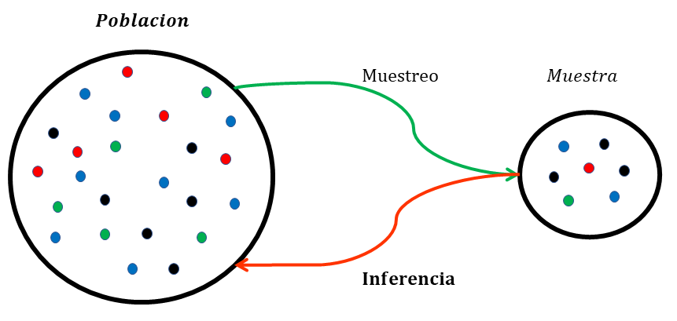
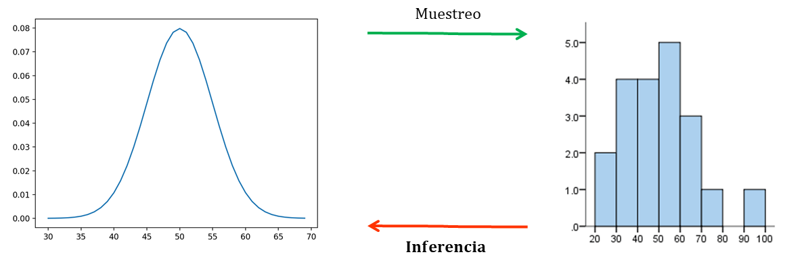

```{r echo=F, message = FALSE, warning =F}
library(pacman)
p_load(tidyverse)
p_load(kableExtra)
p_load(knitr)
p_load(latex2exp)   
p_load(ggrepel)
p_load(magick)
set.seed(150)
```

# Introducción

En capitulos anteriores hemos estudiado como se caracteriza y se calculan probabilidades en poblaciones. Vimos como las probabilidades se comportan y se calculan de manera diferente dependiendo de la naturalza de la variable (cualitativa o cuantitativa). Sin embargo, en la pratica, la poblacion no se conoce de manera total, de tal forma que, las funciones de densidad o probabilidades de ciertos eventos son, realmente, desconocidos para nosotros. De hecho, uno de los objetivos principales de la estadistica es el de "aproximarnos" a las verdaderas probabilidades que existen en la poblacion, a traves del estudio de solo una parte minima de la poblacion total. Este ejercicio se denomina inferencia o estimacion y sera el objeto de estudio de este capitulo.

# La Muestra y La Poblacion

La aproximacion a las probabilidades poblacionales comienza con el concepto de la **muestra**. Esta se define como 

* Un subconjunto de unidades de estudio pertenecientes a un poblacion de interes

Es decir que la muestra siempre se suscribe en el marco de una poblacion, la cual se desea estudiar. Todo estudio estadistico parte de la intencion de estudiar o caracterizar una o varias variables en una poblacion determinada. Veamos algunos ejemplos de esto.

* En una tesis de doctorado se desea conocer la proporcion de sujetos que padece algun tipo de enfermedad autoinmune. Este rasgo se estudiara en los habitantes de Bogota.
* En una tesis de pregrado se desea estudiar como se distribuye el indice de masa corporal en los estudiantes del programa de ciencias de la reahibilitacion en la universidad del rosario.
* En un proyecto de investigacion pagado por colciencias, se desea conocer la probabilidad de desarrollar algun tipo de cancer de pulmon en los trabajadores de las diferentes plantas petroquimicas de ecopetrol durante el periodo de tiempo 1985-2000.

Notese que en todos los ejemplos anteriores se define una poblacion de interes (ciudadanos de Bogota, estudiantes del programa de ciencias de la reahibilitacion en la universidad del rosario o trabajadores de las diferentes plantas petroquimicas de ecopetrol durante el periodo de tiempo 1985-2000). Como vimos en el capitulo anterior, existen infinitas variables aleatorias (es decir un conjunto de valores con su respectiva funcion de densidad) de una misma medida, como por ejemplo el IMC. Es claro que exite una funcion de densidad del IMC para los hombres colombianos, otra para las mujeres europeas, otra para los niños de edades entre los 10 y 15 años, etc. 

Cada una de estas variables aleatorias, desde el punto de vista estadistico, corresponden a poblaciones diferentes. Es aqui cuando el concepto comun de poblacion y el concepto estadistico de poblacion difieren. El concepto comun de poblacion hace referencia al conjunto total de individuos delimitado por regiones geograficas, criterios culturales, politicos, etc. 

Desde el punto de vista de la estadistica, una poblacion es sinonimo, de una funcion de densidad y por ende de una variable aleatoria.

De manera similar, el concepto comun de muestra, se entiende como un subconjunto de individuos que pertenecen a una poblacion determinada. Sin embargo desde el punto de vista estadistico, la muestra es un subconjunto de posibles valores en una variable aleatoria. En la estadistica el individuo se ve representado por un numero, una medicion.

# Inferencia

Una vez comprendido los aspectos tecnicos al rededor de la poblacion y la muestra desde el punto de vista estadistico, es posible introducir el concepto de inferencia.

* La inferencia es el proceso mediante el cual se utiliza informacion de una muestra, para deducir propiedades o caracteristicas en una poblacion

Es decir que la inferencia usa datos (operacionalizacion estadistica de la muestra) para conocer la funcion de densidad subyacente (operacionalizacion estadistica de la poblacion).

<center>
```{r sampling1,echo=F,warning =F, fig.width=4, fig.height=2, fig.cap="Concepto de inferencia poblacional"}

```
```{r sampling2,echo=F,warning =F, fig.width=4, fig.height=2, fig.cap="Concepto de inferencia estadistica"}

```
</center>

La pregunta que surge a continuacion es ¿Como se puede extraer informacion de los datos (obtenidos de la muestra) para conocer aspectos de la funcion de densidad en la poblacion, objetivo de estudio?

La respuesta es atravez del calculo de estimadores. Un estimador se define de la siguiente forma:

* Un estimador es una serie de operaciones matematicas aplicadas sobre un conjunto de datos, que bajo supuestos teoricos, se garantiza la obtencion de un valor aproximado al verdadero parametro que desea estimar.

Es asi como el proceso de la estimacion funciona:

1. Una muestra de la poblacion es obtenida.
2. Datos son medidos en la muestra (por ejemplo IMC)
3. Se calcula un estimador para un parametro de interes (los vistos el capitulo anterior, Valores esperado, Varianza, etc).

Queda claro entonces, que el interes principal de la inferencia es conocer la forma (es decir los parametros) de la funcion de densidad poblacional. Esto se hace atraves del caclulo de estimadores sobre la muestra. Los estimadores son operaciones matematicas sobre los datos, que bajo supuestos teoricos garantizan la obtencion de valores cercanos a los verdaderos valores de los parametros en la poblacion de estudio.

Empezaremos nuestro estudio de los estimadores con el histograma

## El histograma

Para repasar que es un histograma sugerimos revizar el siguiente recurso: [Histograma](https://es.wikipedia.org/wiki/Histograma#:~:text=En%20estad%C3%ADstica%2C%20un%20histograma%20es,frecuencia%20de%20los%20valores%20representados.)

En pocas palabras, el histograma es el estimador grafico de la funcion de densidad. Nos concentraremos en mostrar el comportamiento del histograma respecto a la hipotetica funcion de densidad que desea estimar y el efecto que tiene el tamaño de la muestra en la calidad (es decir que tanto se parece el histograma a la verdadera funcion de densidad) de la estimacion. Para esto tomaremos como ejemplo una distribucion normal con valor esperado 70 y varianza 225, para una poblacion hipotetica. Se tomaran diferentes tamaños de muestra y para cada una se construira un hitograma. Los resultados se presentan a continuacion.

<center>
```{r dnormhistgif, echo=F,warning =F, fig.width=4, fig.height=3.5,fig.cap="Comportamiento del histograma para diferentes tamaños de muestra"}
dnorm_hist <- image_read("dnorm_hist.gif") 
dnorm_hist
```
</center>

Como se puede observar en la figura \@ref(fig:dnormhistgif),  a medida que el tamaño de muestra aumenta, el numero de barras que se pueden construir aumenta y, mas importante aun el histograma se asemeja cada vez mas a la funcion de densidad subyancente en la poblacion.

Como puede verse el histograma es un muy buen estimador de la funcion de densidad, ya que se asemaje mucho al objeto que desea estimar. Al referirnos a la similitud entre el histograma y la funcion de densidad, vale la pena dar dos ejemplos de cosas que no suceceden con un histograma y la funcion de densidad que desea estimar:

```{r dnormweird,echo=FALSE, results = 'asis',fig.width=8, fig.height=3.3, fig.cap="histogramas sesgados"}
xrange<-c(50,70)
weight_lim<-c(30, 120)


rngdf<-data.frame(x=rnorm(500,90,10))
p1<-ggplot(data = data.frame(weight = weight_lim), aes(weight)) +
  ylab("f(x)") +xlab("x") + geom_histogram(data = rngdf,aes(x=x,y=..density..),color="black",fill="white",bins=nclass.scott(rngdf$x))+
  stat_function(fun = dnorm, n = 101, args = list(mean = 70, sd = 10),color="blue") +
  theme_bw()

rngdf<-data.frame(x=rnorm(500,70,20))
p2<-ggplot(data = data.frame(weight = weight_lim), aes(weight)) +
  ylab("f(x)") +xlab("x") + geom_histogram(data = rngdf,aes(x=x,y=..density..),color="black",fill="white",bins=nclass.scott(rngdf$x))+
  stat_function(fun = dnorm, n = 101, args = list(mean = 70, sd = 10),color="blue") +
  theme_bw()

gridExtra::grid.arrange(grobs =list(p1,p2),nrow=1,ncol=2)
```

Como se puede apreciar en la figura \@ref(fig:dnormweird), estos histogramas no se asemejan a la verdadera funcion de densidad, las discrepancias presentadas son en localizacion y dispercion. La teoria de inferencia estadistica asegura que esto no sucede siempre y cuando se cumplan algunos supuestos sobre la muestra que se usa para realizar la estimacion. Estos supuestos seran discutidos al final del capitulo.

# Estimadores de parametros

En la seccion anterior estudiamos nuestro primer estimador, el histograma, y el objeto al cual el histograma estima es la funcion de densidad. En el capitulo anterior vimos que las funciones de densidad pueden ser descritas en terminos de parametros de localizacion y dispercion, por tanto, sera natural querer estimar estos parametros con los datos de una muestra. Cada uno de los parametros estudiados posee un estimador, sin embargo en este capitulo solo estudiaremos los estimadores del vlaor esperado, la varianza y la desviacion estandar. Tambien discutiremos brevemente la estimacion de los cuantiles, la cual, claramente involucra a la mediana.

## Estimador del valor esperado

El estimador del valor esperado es el promedio y se define como 

\begin{equation}
\bar{x}=\frac{\sum_{i=1}^n x_i}{n}  (\#eq:prom)
\end{equation}

Es decir la suma de todos los datos de la muestra dividio por el tamaño de la muestra. Sera comun encontrarnos con la notacion $x_i$. Esto simbolisa una observacion de la variable aleatoria $X$ para el sujeto $i-esimo$ de la muestra. De tal forma que la ecuacion \@ref(eq:prom), indica que se deben sumar los datos de los individuos $i=1$ hasta $i=n$ de la variable $x$ y dividirlo sobre el numero total de datos $n$.

Las pregunta que surge ahora es:

* ¿Porque el promedio es un estimador del valor esperado?

Trataremos de dar respuesta a esta pregunta estudiando algunas caracteristicas del promedio.

### El promedio como variable aleatoria

Nuestro camino para enteder porque el promedio es un buen estimador del valor esperado empieza por darnos cuenta que el promedio es una variable aleatoria. Esto significa que existe una funcion de densidad que describe el comportamiento probabilistico del promedio. Es decir que existe $\bar{X}$ y el promedio que calculamos con una muestra, $\bar{x}$ es simplemente un posible valor de muchos posibles.

Pensemos en el siguiente problema de investigacion:

* Se desea estudiar la distribucion del indice de masa corporal en los estudiantes de la Escuela de Medicina y Ciencias de la Salud de la universidad del Rosario. Esta poblacion de interes posee al rededor de 5000 estudiantes. Para este estudio se ha seleccionado una muestra de 100 estudiantes a los cuales se les medira el peso y se calculara el promedio para estimar el valor esperado del IMC.

Pensemos ahora en cuantas posibles muestras de tamaño 100 pueden ser extraidas de un conjunto de 5000 personas. Esta fuera del alcance de este curso determinar este numero, sin embargo, es un numero tan grande que tiene 200 digitos. Para efectos practicos imaginemos que almenos existen millones de posibles muestras. Entonces, para cada una de estas posibles muestras existen diferentes valores del promedio. Esta variacion de una muestra a otra surge debido a que diferentes personas con diferentes valores de IMC componen las muestras y por ende, los valores de los promedios calculados diferiran.

### Caracterizacion de la funcion de densidad del promedio

Esta variacion de los promedios, debida a la posibilidad muchas muestras, explica de manera intuitiva, como el promedio es realmente una variable aleatoria. Teniendo en cuenta esto, es totalmente plausible preguntarnos acerca del valor esperado del promedio y la varianza del promedio, es decir

$$E(\bar{X}) \; y \; Var(\bar{X})$$

Los estadisticos han determinado el valor de estos parametros para el promedio y son los siguientes:

\begin{equation}
E(\bar{X})=E(X) \;y \; Var(\bar{X})=\frac{Var(X)}{n} (\#eq:prom)
\end{equation}

En donde $E(X)$ y $Var(X)$ son el valor esperado y la varianza de la variable aleatoria original que se desea estudiar a traves de una muestra. En nuestro ejemplo corresponderia al IMC en los estudiantes de la EMCS del rosario.

Recapitulando, nuestro objetivo es estimar el valor esperado del IMC, es decir $E(IMC)$. Para esto se medira el IMC en 100 estudiantes seleccionados al asar para conformar una muestra de tamaño 100. con estos 100 valores podemos calcular un promedio ($\overline{imc}$). Sin embargo, somos concientess de que el promedio obtenido es un de muchos posibles debido al gran numero de muestras posibles que se pueden obtener. Luego, es claro que existe una funcion de densidad para el IMC promedio, es decir existe la variable aleatoria $\overline{IMC}$. Y ahora, segun los criterios estadisticos tenemos que 

$$E(\overline{IMC})=E(IMC) \; y \; Var(\overline{IMC})=\frac{Var(IMC)}{n}$$

¿Que quiere decir esto? Quiere decir que el valor esperado del promedio del IMC es el mismo valor esperado que se queria estimar y por otra parte que la varianza del promedio es la misma varianza del IMC en la poblacion de interes pero dividida sobre el tamaño de la muestra. Esto se representa en la siguiente animacion.

<center>
```{r dnormpromgif, echo=F,warning =F, fig.width=4, fig.height=3.5,fig.cap="funcion de densidad del promedio"}
dnorm_prom <- image_read("dnorm_prom.gif") 
dnorm_prom
```
</center>

En la practica, todo esto garantiza que los valores de los promedios calculados se encuentran al rededor del verdadero valor esperado que se desea estimar y ademas el rango de posibles valores que se pueden observar se concentra cada vez mas, a medida que el tamaño de muestra aumenta. Esto es lo mismo que sucede con el histograma, a medida que el tamaño de muestra aumenta, la calidad de la estimacion aumenta, en este caso, la diferencia entre el verdadero valor esperado y el promedio calculado sera menor.

Por ejemplo, si el promedio se calcula con una muestra de tamaño 10, el 90% de los promedios que se pueden observar se encontraran en el intervalo $`r round(qnorm(.05,23,3/sqrt(10)),2)`- `r  round(qnorm(1-.05,23,3/sqrt(10)),2)`$ mientras que si el promedio se calcula con una muestra de tamaño 100, el 90% de los promedios que se pueden observar se encontraran en el intervalo $`r round(qnorm(.05,23,3/sqrt(100)),2)`- `r  round(qnorm(1-.05,23,3/sqrt(100)),2)`$, ver figura \@ref(fig:dnormprom2)

<center>
```{r dnormprom2,echo=FALSE, results = 'asis',fig.width=9.5, fig.height=3.3,warning =F, fig.cap="Funciones de densidad para promedios con diferente tamaño de muestra"}
weight_lim<-c(11, 36)


p1<-ggplot(data = data.frame(weight = c(13,33)), aes(weight)) +
  ylab("f(imc)") +xlab("imc") + 
  stat_function(fun = dnorm, n = 101, args = list(mean = 23, sd = 3),aes(color="blue")) +
  stat_function(fun = dnorm, n = 1000, args = list(mean = 23, sd = 3/sqrt(10)),aes(color="red")) +
  scale_color_identity(name = "",
                       breaks = c("blue", "red"),
                       labels = c("IMC","prom. n=10"),
                       guide = "legend")+
  ylim(0,.45)+
  scale_x_continuous(breaks=seq(11,36,by=2))+
  geom_segment(aes(x=23,xend=23,y=0,yend=.025),linetype=1)+
  stat_function(fun = dnorm, args = list(mean = 23,sd=3/sqrt(10)),
                xlim = c(qnorm(.05,23,3/sqrt(10)),qnorm(1-.05,23,3/sqrt(10))),
                geom = "area",fill="red",alpha=0.5)+
  annotate("text", x = c(23), y = c(.04), 
           label ="E(IMC)", size=3)+
  annotate("text", x = c(23), y = c(.45), 
           label =substitute(paste("P(", v," < ",bar(IMC)," < ",s,")= 0.9"),
                             list(v=round(qnorm(.05,23,3/sqrt(10)),2),s=round(qnorm(1-.05,23,3/sqrt(10)),2))), size=4)+
  theme_bw()


p2<-ggplot(data = data.frame(weight = c(13,33)), aes(weight)) +
  ylab("f(imc)") +xlab("imc") + 
  stat_function(fun = dnorm, n = 101, args = list(mean = 23, sd = 3),aes(color="blue")) +
  stat_function(fun = dnorm, n = 1000, args = list(mean = 23, sd = 3/sqrt(100)),aes(color="darkgreen")) +
  scale_color_identity(name = "",
                       breaks = c("blue", "darkgreen"),
                       labels = c("IMC","prom. n=100"),
                       guide = "legend")+
  scale_x_continuous(breaks=seq(11,36,by=2))+
  geom_segment(aes(x=23,xend=23,y=0,yend=.025),linetype=1)+
  stat_function(fun = dnorm, args = list(mean = 23,sd=3/sqrt(100)),
                xlim = c(qnorm(.05,23,3/sqrt(100)),qnorm(1-.05,23,3/sqrt(100))),
                geom = "area",fill="darkgreen",alpha=0.5)+
  annotate("text", x = c(23), y = c(.04), 
           label ="E(IMC)", size=3)+
  annotate("text", x = c(23), y = c(1.38), 
           label =substitute(paste("P(", v," < ",bar(IMC)," < ",s,")= 0.9"),
                             list(v=round(qnorm(.05,23,3/sqrt(100)),2),s=round(qnorm(1-.05,23,3/sqrt(100)),2))), size=4)+
  theme_bw()

p3<-ggplot(data = data.frame(weight = weight_lim), aes(weight)) +
  ylab("f(imc)") +xlab("imc") + 
  stat_function(fun = dnorm, n = 101, args = list(mean = 23, sd = 3),aes(color="blue")) +
  stat_function(fun = dnorm, n = 1000, args = list(mean = 23, sd = 3/sqrt(10)),aes(color="red")) +
  stat_function(fun = dnorm, n = 1000, args = list(mean = 23, sd = 3/sqrt(100)),aes(color="darkgreen")) +
  scale_color_identity(name = "",
                       breaks = c("blue", "red","darkgreen"),
                       labels = c("IMC","prom. n=10","prom. n=100"),
                       guide = "legend")+
  ylim(0,.5)+
  scale_x_continuous(breaks=seq(11,36,by=2))+
  geom_segment(aes(x=23,xend=23,y=0,yend=.025),linetype=1)+
  geom_segment(aes(x=23,xend=23,y=0,yend=.025),linetype=1)+
  annotate("text", x = c(23), y = c(.04), 
           label ="E(IMC)", size=3)+
  annotate("text", x = c(31), y = c(.75), 
           label =paste0("n= ",50), size=6)+
  theme_bw()

gridExtra::grid.arrange(grobs =list(p1,p2),nrow=1,ncol=2)
```
</center>

Si el mismo promedio se calculara con una muestra de tamaño mil, el 90% de los promedios que se pueden observar se encontraran en el intervalo $`r round(qnorm(.05,23,3/sqrt(1000)),2)`- `r  round(qnorm(1-.05,23,3/sqrt(1000)),2)`$. Con todo esto, queda claro que entre mayor sea el tamaño de muestra, mas cerca estara el promedio del verdadero valor esperado que se desea estimar.

Estos argumentos teoricos, son los garantizan la idoneidad del promedio como estimador del valor esperado.

## Estimador de la Varianza y la desviacion estandar

El estimador de la Varianza se denomina varianza muestral y se define como 

\begin{equation}
S^2=\frac{\sum_{i=1}^n (x_i-\bar{x})^2}{n-1}  (\#eq:s2)
\end{equation}

El estimador de la desviacion estandar se denomina desviacion estandar muestral y se define como 

\begin{equation}
S=\sqrt{ \frac{\sum_{i=1}^n (x_i-\bar{x})^2}{n-1} } (\#eq:s)
\end{equation}

Los argumentos de por que estas formulas son estimadores idoneos siguen las mismas lineas de los argumentos presentados para el promedio, estimador del valor esperado, y no se discutiran en este curso.