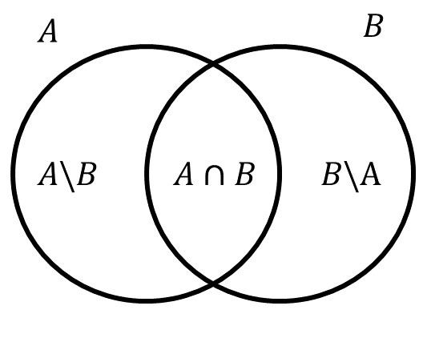

```{r echo=F, message = FALSE, warning =F}
###see https://bookdown.org/yihui/rmarkdown-cookbook/cross-ref.html for cross reference
###see https://bookdown.org/yihui/bookdown/internationalization.html for _bookdown.yml
rm(list=ls())
list.of.packages <- c("pacman")
new.packages <- list.of.packages[!(list.of.packages %in% installed.packages()[,"Package"])]
if(length(new.packages)) install.packages(new.packages)
library(pacman)
p_load(tidyverse)
p_load(kableExtra)
p_load(knitr)
p_load(ggbeeswarm)
p_load(latex2exp)
p_load(epitab)
p_load(plotrix)
p_load(graphics)
p_load(latex2exp)
set.seed(150)

```


```{r echo=FALSE, results = 'asis'}
ca_ctr_r<-.3

n<-250
nCA<-round(n*ca_ctr_r)
z0<-data.frame(status=c(rep("CA",nCA),rep("CTR",n-nCA)))
z0$exposition<-NA
exp_CA<-.45
exp_CTR<-.19

z0[z0$status %in% "CA","exposition"]<-ifelse(runif(nCA)<exp_CA,"yes","no")
z0[z0$status %in% "CTR","exposition"]<-ifelse(runif(n-nCA)<exp_CA,"yes","no")

z0$exposition<-factor(z0$exposition,levels = c("yes","no"))
```
# Introduccion
En este documento estudiaremos los conceptos basicos de probabilidad. Para empezar, consideremos un ejemplo, se han recopilado uns datos de un estudio de casos y controles, `r nCA` casos y `r n-nCA` controles, para un total de `r n` individuos. Se han estudiado a estos indivduos para ver si habian estado expuestos a un agente toxico de interes para los investigadores. A continuacion presentamos un breve resumen de los datos.

```{r , echo=F, fig.width=6, fig.height=4}
summary(z0)
```

Para visualizar mejor la informacion, construiremos una table de contingencia para las dos variables ver tabla \@ref(tab:conttabl)
```{r conttabl, echo=FALSE}
###see http://haozhu233.github.io/kableExtra/awesome_table_in_html.html
res<-kable(t(table(z0)%>%addmargins),caption="Tabla de contingencia status vs exposition")
kable_styling(res,"striped", position = "center",full_width = F)%>% add_header_above(c("exposition","status"=2," "))
# res<-t(table(z0)%>%addmargins)
# knitr::kable(res,caption="Tabla de contingencia: status vs exposition")
```

Al rededor de esta tabla de contingencia podemos hacernos varias preguntas como por ejemplo:

* Cual es la probabilidad de ser un caso? 

* Cual es la probabilidad de estar expuesto?

* Cual es la probabilidad de ser un caso o ser un no expuesto?

* Cual es la probabilidad de ser un control y no estar expuesto simultaneamente?

* Dado que se es un caso, cual es la probabilidad de estar expuesto?

Para responder estas preguntas de manera metodica se han desarrollado los axiomas de probabilidad. Estos axiomas son las reglas que nos permitiran calcular probabilidades bajo ciertas condiciones y de manera segura, evitando recurrir a la intuicion. La probabilidad es una medida que se aplica a conjuntos (denominados eventos en la practica). Por tanto el lenguaje en el que se encuentran codificados estos axiomas se base en el lenguaje de teoria de conjuntos, el cual repasaremos a continaucion.

# Teoria de conjuntos

Un conjunto se define por sus elementos, por ejemplo los estudiantes del curso A (Ana, Juan, Pedro, Laura, Silvia) y los estudaintes del curso B (Carlos, Diana):
<center>
```{r TCexample,echo=F,warning =F, fig.width=6, fig.height=6, fig.cap="Ejemplos sobre conjuntos"}
plot(NULL,xlim=c(-10,15),ylim=c(-11,12.5),axes=F,xlab="",ylab="")
rect(-10,-11,15,12)
draw.circle(0,0,9,nv=1000,lty=1,lwd=1,border="blue")
draw.circle(10,9,2.5,nv=1000,lty=1,lwd=1,border="red")
draw.circle(4.25,1.75,2.7,nv=1000,lty=1,lwd=1,border=3)
df_curso<-data.frame(name=c("Ana","laura","Pedro","Juan","Silvia","Carlos","Diana"),x=c(-5,0,4.5,4.2,-3,10,10),y=c(2,-5,3.5,0,7,10,7.9))
text(df_curso$x,df_curso$y,df_curso$name)
text(-7.8,7,"A",col="blue",cex=1.5)
text(13.8,10,"B",col="red",cex=1.5)
text(2.5,5,"C",col=3,cex=1.5)
text(-10,12.7,"U",col=1,cex=1.5)

```
</center>

En el lenguaje de teoria de conjuntos existen dos relaciones fundamentales:

* La pertenencia $\in$
* La contencia $\subset$

Los elementos pertenecen a conjuntos (por ejemplo $Silvia \in A$), los conjuntos estan contenidos en otros conjuntos ($C \subset A$). Es incorrecto decir que que Carlos esta contenido en el conjunto B, ya que Carlos es un elemento y no un conjunto. Tambien es incorrecto decir que $C\in A$ ya que C es un subconjunto de A y no un elemento (ver figura en la figura \@ref(fig:TCexample)). En resumen, afirmaciones correctas sobre la figura \@ref(fig:TCexample) son:

* $Ana \in A$

* $Carlos \in B$

* $C \subset A$

Afirmaciones incorrectas sobre la figura \@ref(fig:TCexample) son:

* $Ana \subset A$

* $C \in A$

La forma de expresar que un elemento no pertenece a un conjunto, como por ejemplo, "Ana no pertenece a C", es mediante el simbolo $\notin$, de tal forma que $Ana \notin C$. De manera similar, para expresar que un conjunto no esta incluido en otro ("B no esta incluido en A") se usa el simbolo $B \not\subset A$, ver figura \@ref(fig:TCexample).

En la figura \@ref(fig:TCexample) los conjuntos se presentan de manera **grafica**, sin embargo existen otras formas de notacion de los conjuntos. A continuacion presentamos la notacion **extensiva**:

* $A=\{Ana,laura,Pedro,Juan,Silvia\}$

* $B=\{Carlos,Diana\}$

* $C=\{Pedro,Juan\}$

En esta notacion se usan los corchetes $\{\}$ como analogo del laso en la representacion grafica, y dentro de estos, se listan de manera **extensiva** los elementos del conjunto separados por ",".

Existe otra forma de definir conjuntos, denominada la definicion por **comprencion**, veamos un ejemplo: "C es el conjunto de personas en el conjunto A *tal que* esas personas son hombres." Aqui, se usa una condicion, que define la pertenencia de elementos a un conjunto. Esta es la forma mas comun de definir conjuntos y es la que adoptaremos regularmente en este texto.

La definicion por extencion siempre comprende 2 partes. Veamos nuestro ejemplo: C es el conjunto

1. de personas en el conjunto A

2. *tal que* esas personas son hombres.

La primera parte hace referencia al conjunto de referencia, sobre el cual se aplicara una condicion logica, la segunda parte de la definicion. 

Bajo esta forma de definir conjuntos, existe un concepto fundamental, el del conjunto universo:

* El universo es el conjunto que contiene a todos los posibles elementos. 

En la figura \@ref(fig:TCexample) el universo se representa por el conjunto $U$.

La forma en que se define un conjunto por compresion sigue el siguiente patron:

$$T=\{x \in U | Cond(x)\}$$
Su interpretacion es la siguiente: T es el conjunto ($T=\{ \}$) de los elementos del universo ($x \in U$), tal que ($|$), esos elementos cumplen una condicion determinada ($Cond(x)$).

Por ejemplo, considerese el conjunto de los numeros entero como el universo: $\mathbb{Z}=\{...,-2,-1,0,1,2,...\}$, entonces, el conjunto de los numeros positivos se difinira como

$$Positivos=\{x \in \mathbb{Z} | x > 0 \}$$


## Operaciones de conjuntos

a continuacion presentaremos las tres operaciones basicas de conjuntos: La _**Union**_ ,la  _**Interseccion**_ y el _**Complemento**_.

### Union
La union de dos conjuntos da como resultado un nuevo conjunto que contiene todos los elementos de los dos conjuntos unidos. Consideremos dos conjuntos $A$ y $B$ cualquiera incluidos en un conjunto universo $U$. Entonces, la Union entre $A$ y $B$ se define como:

$$A \cup B =\{x \in U | x \in A \; ó \; x \in B\}$$
La interpretacion de la anterior formula es asi: La Union entre $A$ y $B$ ($A \cup B$), es el conjunto ($=\{\}$) de los elementos en el universo ($x \in U$), tal que ($|$), esos elementos pertenecen al conjunto $A$ **ó** pertenecen al conjunto $B$ ($x \in A \; ó \; x \in B$).
 
 Veamos un ejempo, en el universo de la figura \@ref(fig:TCexample), $B \cup C=\{Carlos, Diana,Pedro, Juan\}$.
 
 Veamos otro ejemplo en la figura \@ref(fig:TCexample2)
<center>
```{r TCexample2,echo=F,warning =F, fig.width=6, fig.height=6, fig.cap="Ejemplo 2 sobre conjuntos"}
plot(NULL,xlim=c(-10,10),ylim=c(-7,8),axes=F,xlab="",ylab="")
rect(-10,-7,10,7)
draw.circle(-3,0,5,nv=1000,lty=1,lwd=1,border="blue")
draw.circle(3,0,5,nv=1000,lty=1,lwd=1,border="red")
df_ex2<-data.frame(name=c("a","b","c","d","e","f","g"),x=c(-5,-3,0,0,3.5,5,7.5),y=c(2,-2,-2,2.5,-3,2.8,-5))
text(df_ex2$x,df_ex2$y,df_ex2$name)
text(-10,7.5,"U")
text(-7,4,"Z",col=4)
text(7,4,"W",col = 2)
```
</center>

En la figura se puede apreciar que $Z\cup W =\{a,b,c,d,e,f\}$

### Interseccion
La Interseccion de dos conjuntos da como resultado un nuevo conjunto que contiene todos los elementos que se encuentran simultaneamente en ambos conjuntos. Consideremos dos conjuntos $A$ y $B$ cualquiera incluidos en un conjunto universo $U$. Entonces, la Interseccion entre $A$ y $B$ se define como:

$$A \cap B =\{x \in U | x \in A \; y \; x \in B\}$$
La interpretacion de la anterior formula es asi: La Interseccion entre $A$ y $B$ ($A \cap B$), es el conjunto ($=\{\}$) de los elementos en el universo ($x \in U$), tal que ($|$), esos elementos pertenecen al conjunto $A$ **y** pertenecen al conjunto $B$ simultaneamente ($x \in A \; ó \; x \in B$).

Veamos un ejempo, en el universo de la figura \@ref(fig:TCexample2) se puede apreciar que $Z\cap W =\{c,d\}$, ya que los elementos c y d son los unicos que se encuentran simultaneamente en mabos conjuntos.

### Complemento

En las dos operaciones anteriores, vimos que las condiciones logicas que definen los conjuntos son "ó" e "y". Para la defincion del complemento la palabra clave sera el "no". Consideremos un conjunto $A$ cualquiera incluido en un conjunto universo $U$. Entonces el complemento del conjunto A se define como 
$$A^c=\{x \in U | x \notin A\}$$

La interpretacion de la anterior formula es asi: El complemento del conjunto A ($A^c$) es el conjunto ($=\{\}$) de los elementos del universo ($x \in U$), tal que ($|$), esos elementos **no** pertenecen a el conjunto A ($x \notin A$).
$A^c$ Es simeplemente el conjunto de todos aquellos elementos que **no** pertenecen a el conjunto A.

Por ejemplo, en la figura \@ref(fig:TCexample2), $Z^c=\{f,e,g\}$. De manera similar $W^c=\{a,b,g\}$.

Ejercicio:
cual es el complemento del complemento del conjunto $Z$  en la figura \@ref(fig:TCexample2)?
Dedusca de esto que en general para cualquier conjunto $A$, $(A^c)^c=?$

### Conmutatividad

Se puede demostrar que lo siguiente se cumple:
$$A\cup B= B\cup A$$
$$A\cap B= B \cap A$$
Es decir que no importa el orden de los conjuntos en la union y la interseccion.

## El conjunto Vacio $\phi$

Si el conjunto $U$ es el conjunto universo, para el cual cualquier elemento pertenece a el, quien ser aentonces el complemento del universo, es decir $U^c$?. Segun la definicion de complemento, tendriamos que:

$$U^c=\{x \in U | x \notin U\}$$
Es decir, que $U^c$ es el conjuno de aquellos elementos que simultaneamente estan y a la vez no estan en el universo. Esto en logica se conoce como una contradiccion, por lo cual no exite ningun elemento que pertenesca a $U^c$, por tanto el conjunto $U^c$ es vacio.
Este vacio suele representarse de forma extensiva como $U^c=\{\}$. De aqui en adelante denotaremos al conjunto vacio mediante la letra griega $\phi$ (phi).

El conjunto vacio tiene algunas propiedades, que presentamos a continuacion. Considere un conjunto $A$ cualquiera, incluido en un Universo $U$. Entonces:

* $\phi \subset A$

* $\phi \cup A=A$

* $\phi \cap A= \phi$

##Propiedades generales de las operaciones de conjuntos
A continuacion listamos algunas propieades generales que se surgen a partir de las definiciones de la _**Union**_ ,la  _**Interseccion**_ y el _**Complemento**_. Para esto considere dos conjuntos $A$ y $B$ cualquiera, incluidos en el universo $U$.

* $A \cup U =U$

* $A \cap U =A$

* Si $A \subset B$ entonces $A \cup B =B$ y $A \cap B =B$

* $A \cup A^c =U$

* $A \cap A^C= \phi$

## Aplicaciones practicas de las operaciones de conjuntos

La discucion de las operaciones de conjuntos hecha hasta el momento es abstractay bastante general, y la mayoria de los estudiantes duda de la importancia de estos conceptos en la practica. Por esta razon, mostraremos a continuacion la utlidad de estos conceptos en problemas de investigacion. Para esto retomaremos el ejemplo con el que se inicio este documento y lo reproduciomos nuevamente para facilidad de lectura.

Se han recopilado uns datos de un estudio de casos y controles, `r nCA` casos y `r n-nCA` controles, para un total de `r n` individuos. Se han estudiado a estos indivduos para ver si habian estado expuestos a un agente toxico de interes para los investigadores. La informacion recopilada se resume en la siguiente tabla de contingencia:

```{r conttablrep, echo=FALSE}
res<-kable(t(table(z0)%>%addmargins),caption="Tabla de contingencia status vs exposition")
kable_styling(res,"striped", position = "center",full_width = F)%>% add_header_above(c("exposition","status"=2," "))
# res<-t(table(z0)%>%addmargins)
# knitr::kable(res,caption="Tabla de contingencia: status vs exposition")
```

En este caso, la variable exposicion con categorias "CA" y "CTR", realemnte indexan la pertenecia de individuos a dos conjuntos: el de los casos (CA) y el de los controles (CTR). De tal forma que en la tabla \@ref(tab:conttablrep) podemos saber cuantas personas hay en el conjunto CA y en el conjunto CTR. Segun la tabla podemos ver que hay 75 personas en el conjunto "CA" y 175 en el conjunto "CTR". 

De manera similar, la variable "exposition" con categorias "yes" y "no" indexan la pertencia de cada sujeto de el estudio a los conjunto de exposicion y no exposicion respectivamente. Teneindo esto en cuenta, podriamos pensar por ejemplo en:

$$CA \cup yes$$

Es decir, la union entre el conjunto de casos y el conjunto de personas expuestas. Cuantas personas hay en este conjunto? La respuesta puede ser deducida a partir de la siguiente visualizacion:

<div class = "row">
<div class = "col-md-6">
```{r conttablrep1, echo=FALSE}
res<-kable(t(table(z0)),caption="CA unido \"yes\"")
kable_styling(res,"striped", position = "center",full_width = F)%>% add_header_above(c("exposition","status"=2))%>%
  column_spec(2,background = "green")%>%
  row_spec(1,background = "green")
# res<-t(table(z0)%>%addmargins)
# knitr::kable(res,caption="Tabla de contingencia: status vs exposition")
```
</div>
<div class = "col-md-6">
```{r CAUyesfig,echo=F,warning =F, fig.width=4, fig.height=4, fig.cap="Visualizacion de CA y yes en conjuntos"}
plot(NULL,xlim=c(-10,10),ylim=c(-7,8),axes=F,xlab="",ylab="")
rect(-10,-7,10,7)
draw.circle(-3,0,5,nv=1000,lty=1,lwd=1,border="blue")
draw.circle(3,0,5,nv=1000,lty=1,lwd=1,border="red")
df_ex3<-data.frame(name=c(46,29,75),x=c(-3.9,0,3.9),y=c(0,0,0))
text(df_ex3$x,df_ex3$y,df_ex3$name)
text(-7,4,"CA",col=4)
text(7,4,"yes",col = 2)
```
</div>

El numero de personas en $CA \cup yes$ es $46+29+75=150$ `r 46+29+75`.

Que interpretacion tiene $CA \cup yes$ desde el punto de vista practico? son las personas enfermas (CA) o que han estado expuestas (yes) al agente toxico de estudio. Veamos otro ejemplo:

$$CTR \cap no$$
Este conjunto es el de aquellas personas que no estan enfermas (CTR) y que adicionalmente no han tenido exposicion al agente toxico de estudio (no). Cuantas personas hay en este conjunto? de la tabla \@ref(tab:conttablrep) se puede apreciar que son 100 personas.

# Axiomas de probabilidad

Ahora que ya repazamos el lenguaje de teoria de conjuntos, podemos empezar nuestro abordaje de los axiomas de probabilidad que nos permitiran hacer calculos probabilisticos.

## El universo

Nuestra discucion de los axiomas de probabilidad empiezan con la definicion del universo. Para nosotros el universo es el conjunto de todos los posibles resultados en nuestro objeto de estudio. Por ejemplo, si se estudia el lansamiento de una moneda, los posibles resultados son *cara* o *sello*, luego el universo es el conjunto $U=\{cara,sello\}$. Si estudimos el lansamiento de un dado, el conjunto de posibles resultados es $U=\{1,2,3,4,5,6\}$. Estos ejemplos son triviales y poco practicos, para nuestro ejemplo del estudio de casos y controles cual seria el conjunto universo? seria el conjunto de las 250 personas involucradas en el estudio (ver tabla \@ref(tab:conttablrep)).

## La medida de probabilidad

Nuestro objeto de estudio en este documento es la probabilidad, y es hora de definarla de manera concreta: La probabilidad es una medida que se aplica a conjuntos. Que se quiere decir con esto? basicamente que el objeto de medida de la probabilidad son los conjuntos. Analogamente el objeto de medida de una bascula es un objeto fisico, el objeto de medida del pH son soluciones, el objeto de medida de una prueba diagnostica son pacientes, etc. Ya sabemos a que objetos podemos aplicar la medida de probabilidad, son embargo aun no hemos respondido la pregunta: ¿Que significa la medida de probabilidad?, ¿Que significa una probailidad del 50% o del 70%?, para responder a esta pregunta vease ref.

## Axiomas
Los Axiomas de probabilidad determinan las propiedades y el comportamiento de la probobilidad. 

### Axioma 1
\begin{equation}
Si \; A \subseteq U \Rightarrow 0\le P(A) \le 1 (\#eq:A1)
\end{equation}


El formula \@ref(eq:A1) establece que la medida de probabilidad se aplica a subconjuntos en algun conjunto universo $U$ y que su resultado es un numero real entre 0 y 1. La interepretacion de la formula \@ref(eq:A1) es la siguiente:

Si $A$ es un subconjunto del universo $U$, el cual podria llegar a ser el mismo universo ($A \subseteq U$), entonces ($\Rightarrow$), la medida de probabilidad de $A$ ($P(A)$), es un numero real entre 0 y 1 ($0\le P(A) \le 1$).
Este axioma se considera como la definicion de medida de probabilidad.

Nota: en esta discucion las probabilidades son numeros entre 0 y 1. Para algunos es mas comodo hablar de probabilidades entre 0 y 100%. Se sugiere hacer los calculos con probabilidades entre 0 y 1 ya que son mas simples. Para pasar de la escala $0-100$ a la escala $0-1$, basta con dividir por 100 a las proabilidades en escala $0-100$.

### Axioma 2
\begin{equation}
P(U)=1 (\#eq:A2)
\end{equation}

Este axioma establece que la medida de probabilidad del conjunto universo es 1. Veamos por que esto tiene sentido: supongamos que $U=\{cara,sello\}$, y que nuestro objeto de estudio es lanzar una moneda y obsrvar que lado cae hacia arriba. Decir que $P(U)=1$, implica que al lanzar la moneda observaremos algun posible resultado en $U$, cara o sello, observar algo diferente seria imposible y por tanto la probabilidad de observar alguno de los dos resultados (cara o sello) es 1.

### Axioma 3
\begin{equation}
Si \; A \subseteq U \Rightarrow P(A^c) = 1- P(A) (\#eq:A3)
\end{equation}

La interepretacion de esta formula es la siguiente: Si $A$ es un subconjunto del universo $U$, el cual podria llegar a ser el mismo universo ($A \subseteq U$), entonces ($\Rightarrow$), la medida de probabilidad del complemento de A ($P(A^c)$) es 1 menos la probabilidad del mismo conjunto ($1- P(A)$). Este axioma establece que la medida de probabilidad de un conjunto complemento es 1 menos la probabilidad del mismo conjunto. Veamos un ejemplo:

Suponga que en una poblacion, el porcentage de mugeres es del 40%, es decir que $P(Femenino)=0.4$. En este contexto que seria $Femenino^c$? Seria simplemente el conjunto de las persona que no son mujeres, es decir los hombres, luego $Femenino^c= Masculino$ y segun la formula \@ref(eq:A3), $P(Femenino^c)=P(Masculino)=1-P(Femenino)=1-0.4=0.6$, lo cual tiene sentido.

Esta nocion de complemento es sumamente util al resolver ejercicios de probobilidad. Vemaos otro ejemplo: En una poblacion dada, la probabilidad de desarrollar cancer es del 5%. Esto quiere decir que existe un conjunto que llamaremos $Ca$, el cual es el conjunto de personas con cancer y por tanto $P(Ca)=0.05$ (5%/100=0.05). Esto implica, segun la formula \@ref(eq:A3), que $P(Ca^c)=1-0.05=0.95$, $Ca^c$ es el complemento del conjunto de personas con cancer, es decir el conjunto de personas sanas, luego en esta poblacion, la probabilidad de no tener cancer es del 95%

Siempre que nos den la probabilidad de un conjunto (o evento, como tambien se suele llamar), automaticamente aplicando la formula \@ref(eq:A3), podemos obtener la probabilidad de su complemento. Si conocemos la probabilidad de las mujeres, conocemos tambien la de los hombres. Si conocemos la probabilidad de estar enfermo, automaticamente conocemos la probabilidad de estar sano.

### Axioma 4

\begin{equation}
Si \; A,B \subseteq U \; | \; A \cap B = \phi \Rightarrow P(A \cup B) = P(A)+P(B) (\#eq:A4)
\end{equation}

La interepretacion de esta formula es la siguiente:  Si $A$ y $B$ son subconjuntos del universo $U$ ( $A,B \subseteq U$), tal que ($|$) la interseccion de $A$ y $B$ es vacia ($A \cap B = \phi$), entonces ($\Rightarrow$), la probabilidad de la union de $A$ y $B$ se puede calcular como la suma de las probabilidades de $A$ y $B$ ($P(A \cup B) = P(A)+P(B)$)

Este axioma es uno de los mas importantes de todos. A continuacion explicaremos su utilidad. Supongamos que una poblacion (es decir conjunto universo $U$) de 16 personas, 7 son mujeres. Si seleccionaramos una persona al azar, cual seria la probabilidad de que la persona fuera mujer? Supongamos que la probabilidad de ser seleccionado es la misma para cualquiera de las 16 personas y por ende esta probabilidad es $1/16$. Consideremos conjuntos  de un unico elemento, cada una de las 16 personas. Es claro que estos conjuntos son disyuntos entre si (es decir la interseccion es vacia). Si cojemos todos los conjuntos de personas mujeres y los unimos obtendriamos el conjunto de las mujeres. Aplicando la formula \@ref(eq:A4) la probabilidad de este conjunto seria la suma de las probabilidades individuales de cada conjunto, lo cual corresponde a $7 \times 1/16=0.4375$ (ver figura \@ref(fig:A4image))).

```{r A4image,echo=F,warning =F, fig.width=4, fig.height=4, fig.cap="Ejemplo aximoa 4"}
knitr::include_graphics("grafico_A4.png")

```

Este axioma justifica el calculo de probabilidades aplicando la regla de contar el numero de casos que cumplen la condicion dividiendo por el numero total de casos en la pobalcion (Esto sin embargo, solo es balido si se asume que cada individuo tiene la misma probabilidad de ocurrencia).

En el ejemplo de los casos y controles de la tabla tabla \@ref(tab:conttablrep), la probabilidad de ser expuesto al agente toxico en esa poblacion seria de $\frac{104}{250}=0.416$

```{r echo=FALSE, results = 'asis'}
N<-1000
v1_nc<-3
v2_nc<-2

v1_props<-c(.24,.35,1-(.24+.35))
names(v1_props)<-LETTERS[1:length(v1_props)]
v2_given_v1probs<-matrix(c(.1,.9,
                           .3,.7,
                           .18,1-.18),byrow =T,ncol = 2)
colnames(v2_given_v1probs)<-c("R","S")
rownames(v2_given_v1probs)<-names(v1_props)

N*v1_props%>%round(1)->v1_n

z1<-data.frame(v1=rep(names(v1_props),v1_n),v2=NA)

for(i in names(v1_props)){
  z1[z1$v1 %in% i,"v2"]<-sample(colnames(v2_given_v1probs),v1_n[i],T,v2_given_v1probs[i,])
}
z1$v2<-factor(z1$v2)
```
Veamos otro ejemplo. Una empreza con tres fabricas produce protesis ortopedicas. Se ha realizado un estudio en donde se han extraido `r N` protesis de un lote de produccion de las tres fabricas y se ha determinado si las protesis superan (S) o reprueban (R) una prueba de control de calidad. En la tabla \@ref(tab:conttablz1) se presentan los resultados de dicho estudio.
```{r conttablz1, echo=FALSE}
###see http://haozhu233.github.io/kableExtra/awesome_table_in_html.html
res<-kable(t(table(z1)%>%addmargins),caption="Tabla de contingencia Fabrica vs Falla")
kable_styling(res,"striped", position = "center",full_width = F)%>% add_header_above(c("Falla","Fabrica"=3," "))
# res<-t(table(z0)%>%addmargins)
# knitr::kable(res,caption="Tabla de contingencia: status vs exposition")
```

Cual es la probabilidad de que una protesis provenga de la fabrica A? Segun la tabla \@ref(tab:conttablz1), el numero de protesis producidas en la fabrica A es de `r table(z1$v1)["A"]` y el numero total de protesis es de `r N`, luego la probabilidad de que una protesis provenga de la fabrica A es de `r table(z1$v1)["A"]/N`.

Cuel sera la probabilidad de que una protesis provenga de la fabrica B y halla superado la prueba de control de calidad? En terminos de conjuntos, se nos esta preguntando por $P(B \cap S)$. Notese que hasta el momento no hay ninguna regla de probabilidad que hable de intersecciones. Sin embargo, como conocemnos el numero de elementos en el conjunto $B \cap S$,`r  t(table(z1))["S","B"] `, podemos calcular esta probabilidad como $P(B \cap S)=\frac{281}{1000}=$ `r  t(table(z1))["S","B"]/N ` usando la regla \@ref(eq:A4).

Cual es la probabilidad de que una protesis probenga de la fabrica A o C? Esta pregunta se puede traducir en terminos de lenguaje de teoria de conjuntos como $P(A \cup C)$. Notece que $A \cup C =\phi$, es decir, no hay protesis que hallan sido fabricadas simultaneamente en las dos fabricas, por tanto, aplicando la formula \@ref(eq:A4), $P(A \cup C)= P(A)+P(C)=\frac{200}{1000}+\frac{400}{1000}=600/1000= 0.6$.

### Axioma 5

\begin{equation}
Si \; A,B \subseteq U \Rightarrow P(A \cup B) = P(A)+P(B)-P(A \cap B) (\#eq:A5)
\end{equation}

La interepretacion de esta formula es la siguiente:  Si $A$ y $B$ son subconjuntos del universo $U$ ( $A,B \subseteq U$), entonces ($\Rightarrow$), la probabilidad de la union de $A$ y $B$ se puede calcular como la suma de las probabilidades de $A$ y $B$ menos la probabilidad de la interseccion ($P(A \cup B) = P(A)+P(B)-P(A \cap B)$)

Esta regla se puede deducir de la formula \@ref(eq:A4). Notese que $A\cup B = (A \setminus B) \cup (A\cap B) \cup (B\setminus A)$ en donde $A \setminus B$ es el conjunto de los elementos que estan en $A$ pero no en $B$. En notacion de teoria de conjuntos seria $A\setminus B=\{x \in U | x \in A \; y  \, x \notin B\}$, tambien puede demostrarse que $A\setminus B= A \cap B^c$. ver figura \@ref(fig:A5image). 

<center>
```{r A5image,echo=F,warning =F, fig.width=4, fig.height=4, fig.cap="Derivacion regla 5"}

```
</center>

Notese que $(A\setminus B) \cup (A\cap B) \cup (B\setminus A)$ es una union disyunta (es decir que los tres conjuntos tienen interseccionos mutuas vacias). Por tanto la regla \@ref(eq:A4) se puede aplicar y $P(A\cup B)= P(A \setminus B) + P(A\cap B) + P(B \setminus A)$. Por otra parte notese que $P(A)= P(A \setminus B) + P(A\cap B)$ luego $P(A \setminus B)= P(A) - P(A\cap B)$. De manera similar $P(B)= P(A\cap B) + P(B \setminus A)$ y por tanto $P(B \setminus A)=P(B)-P(A\cap B)$. De tal forma que

$$P(A\cup B)= P(A \setminus B) + P(A\cap B) + P(B \setminus A)$$
$$=P(A) - P(A\cap B)+P(A\cap B)+P(B)-P(A\cap B)$$
$$=P(A)+P(B)-P(A \cap B)$$

En conclucion, viendo la figura \@ref(fig:A5image), se puede ver que si se suma $P(A)+P(B)$ se esta sumando dos veces el pedazo $P(A\cap B)$ por tanto lo restamos una vez $P(A\cap B)$, obteniendo la formula \@ref(eq:A5).

Veamos como se palica esta regla en un caso practico. Retomemos el ejemplo de las fabricas de protesis ortopedicas.

```{r conttablz1rep, echo=FALSE}
###see http://haozhu233.github.io/kableExtra/awesome_table_in_html.html
res<-kable(t(table(z1)%>%addmargins),caption="Tabla de contingencia Fabrica vs Falla")
kable_styling(res,"striped", position = "center",full_width = F)%>% add_header_above(c("Falla","Fabrica"=3," "))
# res<-t(table(z0)%>%addmargins)
# knitr::kable(res,caption="Tabla de contingencia: status vs exposition")
```

cual es la probabilidad de que una protesis halla sido fabricada en la fabrica A o que la protesis halla reprobado la prueba? En terminos de notacion de teoria de conjuntos, se nos esta preguntando por $P(A \cup R)$. Segun la regla \@ref(eq:A5) tenemos que 
$$P(A \cup R)=P(A)+P(R)-P(A \cap R)$$
$$=\frac{200}{1000}+\frac{201}{1000}-\frac{21}{1000}=\frac{380}{1000}=0.38$$
ver tabla \@ref(tab:conttablz1rep)

### Axioma 6: Probabilidad condicional

\begin{equation}
Si \; A,B \subseteq U \Rightarrow P(A|B) =\frac{P(A \cap B)}{P(B)} (\#eq:A6)
\end{equation}

Esta regla define el concepto de probabilidad condicional $P(A|B)$ (diferente de $A \setminus B$ diferencia de conjuntos). $P(A|B)$ se lee como "La probabilidad de $A$ dado el conjunto $B$". Este concepto es util ya que permite restringir el analisis de una probabilidad, que normalmente ocurriria en el context del conjunto universo, a un conjunto mas reducido. Veamos un ejemplo. 

La probabilidad de desarrollar artritis reumatoide ($AR$) en la poblacion general es del 3% ( $P(AR)=0.03$ ) pero en mujeres ($F$), es mas alta, del 6%. Esto querria decir que $P(AR | F)=0.06$, ya que la probabilidad $P(AR)$ se quiere evaluar no en la poblacion general, si no en el grupo exclusivo de mujeres. A la probabilidad $P(AR)=0.03$, se suele denopminar una **probabilidad marginal**, haciendo enfacis en que el evento en consideracion no es condicionado por ningun otro.

Veamos un ejemplo del claculo de una probabilidad condicional. Teneindo en cuenta la informacion de la tabla \@ref(tab:conttablz1rep), cual es la probabilidad de que una protesis reprobara la prueba dado que fue construida en la fabrica $A$?

La probabilidad en mencion es $P(R|A)$ y segun la formula \@ref(eq:A6) su calculo es $P(R|A)=\frac{P(R \cap A)}{P(A)}$. Segun la tabla, $P(R \cap A)=\frac{21}{1000}$ y $P(A)=\frac{200}{1000}$ luego 

$$P(R|A)=\frac{P(R \cap A)}{P(A)}=\frac{\frac{21}{1000}}{\frac{200}{1000}}=\frac{21}{200}=0.105$$
Es decir que la probabilidad de que una protesis construida en la fabrica $A$ falle la prueba es del 10.5%

### Axioma 7: independencia de eventos

\begin{equation}
Si \; A,B \subseteq U, \; son \; independientes \;  \iff P(A \cap B) =P(A)P(B) (\#eq:A7)
\end{equation}

Esta regla establece cuando dos eventos (conjuntos) son independeintes. La interpretacionde la formula \@ref(eq:A7) es la siguiente: Dos conjuntos en el universo ($A,B \subseteq U$) son independeintes, si y solo si ($\iff$), la probabilidad de la inteseccion es igual al producto de las probabilidades $P(A \cap B) =P(A)P(B)$

Pero que significa la independencia en la regla \@ref(eq:A7)? veamos que pasa con la regla \@ref(eq:A6) si los eventos son independientes. Asumamos que $A$ y $B$ son dos eventos independientes y evaluemos $P(A|B)$. Segun la regla \@ref(eq:A6)

$$P(A|B) =\frac{P(A \cap B)}{P(B)}$$
ya que $A$ y $B$ son independientes entonces $P(A \cap B) =P(A)P(B)$ y reemplazando en la formula anterior obtenemos 

$$P(A|B) =\frac{P(A \cap B)}{P(B)}=$$
$$\frac{P(A)P(B)}{P(B)}=$$
$$P(A)$$
Es decir que si $A$ y $B$ son independientes entonces $P(A|B)=P(A)$. Al ser eventos independientes, la probabilidad condicional es la misma probabilidad marginal. Veamos un ejemplo.

Consideremos dos eventos: el conjunto de pacientes con sindrome del tunel carpiano $TC$ y el conjunto de mujeres $F$. Si los dos eventos son independientes (es decir que la apracion del sindrome no esta relacionada con el genero femenino), entonces se espera que la probabilidad de desarrollar el sindrome en las mujeres sea la misma que en la poblacion general, es decir $P(TC|F)=P(TC)$.

Otro uso de esta regla es para realizar calculos de experimentos como el siguiente: Se sabe que al lanzar una moneda, la probabilidad de que caiga cara ($C$) es de 0.5 y por consiguiente la probabilidad de que caiga sello ($S$) es 0.5 (que regla justifica este resultado?). Si se lanza la moneda 2 veces cual es la probabilidad de que se obtenga cara en el primer lanzamiento y cara en el segundo lansamiento? asumiendo que el evento de salir cara en el segundo resultado es **independiente** del evento salir cara en el primer resultado, la probabilidad de cara, cara es $P(CC)=P(C)P(C)=0.5\times 0.5=0.25$.

El ultimo uso que discutiremos de esta regla es el siguiente: en un estudio se evalua el habito de fumar, caracterisado por fumar ($F$) o no fumar ($NF$) y su relacion con el genero (femenino $Fem$ y masculino $Mas$) a una poblacion de $1000$ personas. Los resultados del estudio se presentan en la tabla \@ref(tab:conttablindep). Se desea determinar si el habito de fumar es independiente del genero femenino.

```{r echo=FALSE, results = 'asis'}
N<-1000
v1_nc<-2
v2_nc<-2

v1_props<-c(0.2,0.8)
names(v1_props)<-c("F","NF")
v2_props<-c(0.4,0.6)
names(v1_props)<-c("Mas","Fem")

prop_tbl<-outer(v1_props,v2_props)

count_tbl<-prop_tbl*N
colnames(count_tbl)<-c("F","NF")
```
```{r conttablindep, echo=FALSE}
###see http://haozhu233.github.io/kableExtra/awesome_table_in_html.html
res<-kable(t(count_tbl),caption="Tabla de contingencia Genero vs habito de fumar")
kable_styling(res,"striped", position = "center",full_width = F)
# res<-t(table(z0)%>%addmargins)
# knitr::kable(res,caption="Tabla de contingencia: status vs exposition")
```

Podemos responder a esta pregunta usando la regla  \@ref(eq:A7). Si efectivamente el genero femenino es independiente del habito de fumar, entonces se cumpliria la siguiente igualdad.

$$P(Fem \cap F)=P(Fem)P(F)$$

Verifiquemos si este es el caso. de la tabla  \@ref(tab:conttablindep) la probabilidad $P(Fem \cap F)=\frac{320}{1000}=$ `r 320/1000`. por otra parte, $P(Fem)=\frac{320+480}{1000}=$ `r (320+480)/1000` y $P(F)=\frac{80+320}{1000}=$ `r (320+80)/1000`, finalmente podemos observar que

$$P(Fem \cap F)=P(Fem)P(F)$$
$$0.32=0.8 \times 0.4$$

Verificandose la regla \@ref(eq:A7) y concluyendo que el habito de fumar es independiente del genero femenino.

Veamos otro ejemplo, esta vez en el estudio del control de calidad de las proteicas ortepedicas, reproducimos la tabla nuevamente por facilidad de lectura.

```{r conttablz1rep2, echo=FALSE}
###see http://haozhu233.github.io/kableExtra/awesome_table_in_html.html
res<-kable(t(table(z1)%>%addmargins),caption="Tabla de contingencia Fabrica vs Falla")
kable_styling(res,"striped", position = "center",full_width = F)%>% add_header_above(c("Falla","Fabrica"=3," "))
# res<-t(table(z0)%>%addmargins)
# knitr::kable(res,caption="Tabla de contingencia: status vs exposition")
```

La pregunta en esta ocacion es si el evento de reprobar la prueba es independeinte del evento en que la protesis fue producida en la fabrica B. De nuevo, si estos eventos fueran independientes, entonces se cumpliria

$$P(R \cap B)=P(R)P(B)$$

Verifiquemos si la igualdad se cumple con los datos de la tabla \@ref(tab:conttablz1rep2): 

* $P(R \cap B)=\frac{119}{1000}=$ `r 119/1000`
* $P(R)=\frac{201}{1000}=$ `r 201/1000` y $P(B)=\frac{400}{1000}=$ `r 400/1000`
* $P(R) \times P(B)= 0.201 \times 0.4=$ `r .201*.4`

ya que la igualdad no se cumple (`r 119/1000` $\neq$ `r .201*.4`), se concluye que los eventos no son independientes. De hecho, la probabilidad $P(R|B)=\frac{119}{400}=$  `r 119/400` es mayor a la probabilidad marginal $P(R)=0.201$.

### Axioma 8

\begin{equation}
Si \; A,B \subseteq U \Rightarrow P(A \cap B) = P(B|A)P(A)=P(A|B)P(B) (\#eq:A8)
\end{equation}

Esta regla da la formula para calcular la probabilidad de una interseccion sin importar si los eventos son o no independientes. Esta formula surge de la regla \@ref(eq:A6), puede usted corrovorarlo?

Veamos algunos ejemplos del uso de esta regla. La probabilidad de desarrollar artritis reumatoide ($AR$) en mujeres es del 6% y el porcentage de mujeres (F) en la poblacion general es del 47%. Calcule cual es el porcentage de mujeres con AR.

Solucion: el 6% reportado corresponde a $P(AR|F)=0.06$ y $P(F)=0.47$. El porcentage de mujeres con AR es $P(AR \cap F)$, luego aplicando la regla \@ref(eq:A8) se tiene que 

$$P(AR \cap F)=P(AR|F)P(F)=0.06\times 0.47=0.0282$$

Es decir que en la poblacion general el porcentage de mujeres con artritis reumatoide es del 2.82%.

### Axioma 9

\begin{equation}
Si \; A,B \subseteq U \Rightarrow P(A|B) =\frac{P(B | A)P(A)}{P(B)} (\#eq:A9)
\end{equation}

Esta regla surge de las formulas \@ref(eq:A6) y \@ref(eq:A8) puede usted corrovorarlo? Veamos un ejemplo de su aplicacion.

La probabilidad de desarrollar artritis reumatoide ($AR$) en mujeres es del 6% y el porcentage de mujeres (F) en la poblacion general es del 47%. Tambien se sabe que la probabilidad de desarrollar AR en la poblacion general es del 4%. Si se se tiene AR, cual es la probabilidad de ser una mujer?

Solucion: el 6% reportado corresponde a $P(AR|F)=0.06$, el 47% corresponde a $P(F)=0.47$ y el 4% corresponde a $P(AR)=0.04$. Si se se tiene AR, la probabilidad de ser una mujer corresponde a $P(F|AR)$, aplicando la regla \@ref(eq:A9):

$$P(F|AR)=\frac{P(AR|F)P(F)}{P(AR)}=\frac{0.06\times 0.47}{0.04}=0.705$$
Es decir que si se tiene AR la rpobabilidad de ser mujer es del 70.5%.

### Axioma 10: probabilidad total

Para esta regla nesecitamos introducir primero el conepto de particion en teoria de conjuntos.

#### Particion
Se denomina particion a un grupo k de conjuntos $A_1,A_2,...,A_k$ si y solamente si satisfacen las dos siguientes propiedades:

1. Para cualquier par de conjuntos $A_i,A_j$ donde $i\neq j$ se tiene que $A_i \cap A_j= \phi$
2. La union de ls k conjuntos produce el universo, esto es $A_1 \cup A_2 \cup ... \cup A_k=U$

Es decir que una particion es un grupo de conjuntos disyuntos cuya union es todo el universo. ver figura \@ref(fig:partition)

```{r partition,echo=F,warning =F, fig.width=6, fig.height=6, fig.cap="Ejemplo de particion con 7 conjuntos"}
plot(NULL,xlim=c(-10,15),ylim=c(-11,12.5),axes=F,xlab="",ylab="")
rect(-10,-11,15,12,lwd=1.5)
segments(-10,0,5,0)
segments(5,-11,5,12)
segments(-5,-11,-5,0)
segments(0,0,0,12)
segments(5,6,15,6)
segments(11,-11,11,6)

text(-9.8,12.9,"U",col=1,cex=1.5)
text(-5,7,expression('A'[1]),col=1,cex=1.5)
text(2.5,6,expression('A'[2]),col=1,cex=1.5)
text(10,9.5,expression('A'[3]),col=1,cex=1.5)
text(13,-2.5,expression('A'[4]),col=1,cex=1.5)
text((5+11)/2,-2.5,expression('A'[5]),col=1,cex=1.5)
text(0,-5,expression('A'[6]),col=1,cex=1.5)
text(-7.5,-5,expression('A'[7]),col=1,cex=1.5)
```
Las particiones mas simples son aquellas generadas por un conjunto y su complemento. Note que $A$ Y $A^c$ generan una particion pues $A\cap A^c= \phi$ y $A \cup A^C=U$. Es decir que los conjuntos de enfermos y su complemento (los sanos) forman una particion, el conjunto de los hombres y su complemento (las mujeres) forman una particion.

ahora que entendemos que es una particon poder presentar la regla 10:

$$Si \; A_1,A_2,...,A_k \;es \;una \; particion \; y \; B\subseteq U \Rightarrow $$
\begin{equation}
P(B) =P(B|A_1)P(A_1)+P(B|A_2)P(A_2)+...+P(B|A_k)P(A_k) (\#eq:A10)
\end{equation}


```{r ptotal,echo=F,warning =F, fig.width=6, fig.height=6, fig.cap="Ejemplo de particion con 7 conjuntos"}
plot(NULL,xlim=c(-10,15),ylim=c(-11,12.5),axes=F,xlab="",ylab="")
rect(-10,-11,15,12,lwd=1.5)
segments(-10,0,5,0)
segments(5,-11,5,12)
segments(-3,-11,-3,0)

segments(5,2,15,2)


draw.ellipse(2.5,0,11,8,border=2)

text(-9.8,12.9,"U",col=1,cex=1.5)

text(-7,8,expression('A'[1]),col=1,cex=1.5)
text(10,9.5,expression('A'[2]),col=1,cex=1.5)
text(10,-8,expression('A'[3]),col=1,cex=1.5)
text(-1,-9.7,expression('A'[4]),col=1,cex=1.5)
text(-8,-6,expression('A'[5]),col=1,cex=1.5)

text(0,10,"B",col=2,cex=1.5)

text(-.5,4,TeX("$A_1 \\bigcap B$"),col=4,cex=1.2)
text(7.2,4,TeX("$A_2 \\bigcap B$"),col=4,cex=1.2)
text(7.2,-4,TeX("$A_3 \\bigcap B$"),col=4,cex=1.2)
text(-.6,-3,TeX("$A_4 \\bigcap B$"),col=4,cex=1.2)
text(-5.5,-2.5,TeX("$A_5 \\bigcap B$"),col=4,cex=1.2)


```

